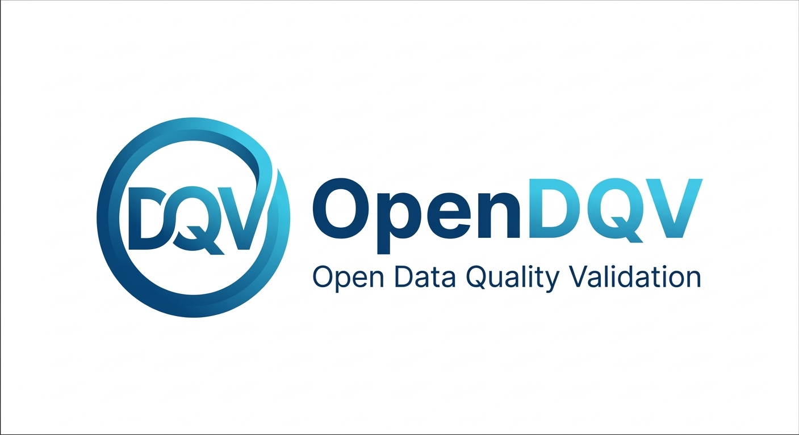
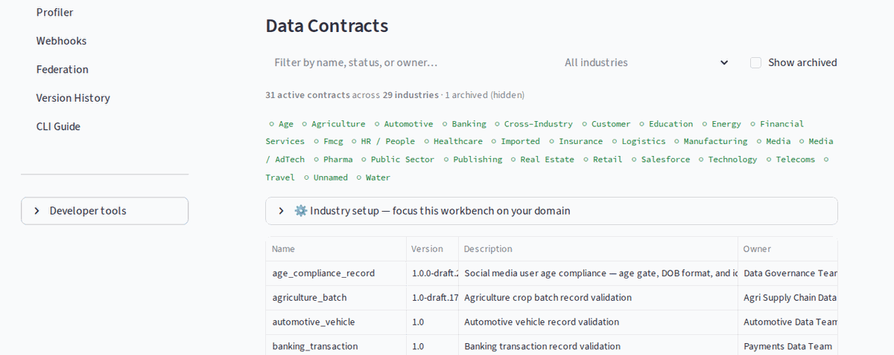

<p align="center">
  
</p>

[](https://github.com/OpenDQV/OpenDQV/actions/workflows/ci.yml)
[](https://github.com/OpenDQV/OpenDQV/blob/main/LICENSE)
[](https://pypi.org/project/opendqv/)
[](https://pypi.org/project/opendqv/)
[](https://github.com/orgs/OpenDQV/packages/container/package/opendqv%2Fopendqv)
[](#)
[](https://securityscorecards.dev/#/projects/github.com/OpenDQV/OpenDQV)

**OpenDQV — the validation bouncer that stops bad data before it enters your systems.**

**Bad data blocked at the door. Not discovered three weeks later.**

*[Trust is cheaper to build than to repair.](docs/ethos.md)*

> **[Get started in 15 minutes →](docs/quickstart.md)**  &nbsp; **[Building with LLMs or AI agents? Read `llms.txt` first →](llms.txt)**

**Who is this for?**
- Data governance teams tired of finding bad records in dashboards three weeks after they were written
- Salesforce / SAP / Kafka / Postgres engineers who need records rejected *before* they're stored
- LLM and AI agent builders who need reliable, contract-driven validation with full governance

---


*The core loop: bad record → 422 with per-field errors → producer fixes it at source. Rejection rates drop over time because the tool changes behaviour, not just outcomes.*

| [Docs](docs/) | [Quickstart](docs/quickstart.md) | [Benchmark](docs/benchmark_throughput.md) | [Rules Reference](docs/rules/) | [Salesforce](docs/salesforce_integration.md) | [Ethos](docs/ethos.md) |
|---|---|---|---|---|---|

---

### Onboarding wizard — zero to first validation in under 90 seconds


*Drop-in setup: the wizard detects Docker, infers rules from your field names, writes a contract, starts the service, and runs your first validation — all before your coffee brews.*

### Visual workbench — browse contracts, filter by industry, monitor live validation metrics



*No-code governance: browse 30+ industry contracts, filter by domain, run live validation, inspect pass/fail metrics — all from the browser.*

### UK Ofcom / Online Safety Act — real-world age verification for social media


*Compliance in a contract: one YAML file enforces the Online Safety Act age-verification requirements — minors blocked, teens flagged with an advisory, adults verified.*

---

**90 seconds to a working contract.** Drop a YAML file in `contracts/`, call `/api/v1/contracts/reload`, start validating. No GUI. No SDK to install in every system. One API, every caller.

> ⚠️ **Before any regulated or production deployment**, review the [Security Policy](SECURITY.md) and complete the mandatory deployment checklist.

---

OpenDQV is the bouncer at the door for your enterprise data. Source systems (Salesforce, SAP, Dynamics, Oracle, Postgres, etc.) call the OpenDQV API *before* writing data. Bad data returns a `422` with per-field errors. Good data passes through. No payload is stored — OpenDQV is a pure validation service.

**The core insight:** A `422` at the point of write changes behaviour. A data quality report three weeks later does not. Every system that calls OpenDQV before writing data creates a real-time feedback loop — developers and data producers see failures immediately and fix them upstream. This is why rejection rates drop over time: the tool changes the incentive, not just the outcome.

```
  Source Systems              OpenDQV                    Result
  ================      ==================      ====================

  Salesforce ----+
  SAP -----------+      +------------------+
  Dynamics ------+----->|  Validation API  |----> valid: true/false
  Oracle --------+      |  (ephemeral)     |      + per-field errors
  Postgres ------+      +--------+---------+      + severity levels
  Web forms -----+               |
  ETL pipelines -+        +------+------+
                          |  Contracts  |
                          |   (YAML)    |
                          +------+------+
                                 |
                          +------+------+
                          |  Contexts   |
                          | per-system  |
                          +-------------+
```

---

## Why OpenDQV?

### The shift-left distinction that actually matters

The phrase "shift-left data quality" has been used for years — but it has almost universally meant *validating earlier in the pipeline*, not validating before data enters any system at all.

| What the industry calls "shift-left" | What OpenDQV actually does |
|---|---|
| Validate at the first pipeline step (post-ingestion) | Validate before any write occurs |
| Scan data at rest in the warehouse | Block data in flight at the source |
| Data engineer runs the check | Source system calls the check |
| Find problems minutes or hours later | Return a per-field error in milliseconds |
| Fix it in the pipeline | Fix it at source, before it is ever stored |

Every tool in the open-source data contract ecosystem — datacontract-cli, Soda Core, Great Expectations, dbt tests — tests data after it lands. OpenDQV is the only open-source tool built as a live validation service that blocks data before it is written.

---

### vs. No Centralised Validation

| Without OpenDQV | With OpenDQV |
|---|---|
| Validation logic duplicated across Salesforce, SAP, Postgres, etc. | One set of validation contracts, one API |
| Contract changes require updates in every system | Update validation contracts centrally — all systems benefit |
| Each team maintains their own validation logic | Governance team owns the validation contracts |
| Bad data discovered after the fact (in dashboards, reports) | Bad data blocked at point of entry |
| No audit trail of what was validated | Prometheus metrics + per-request logging |

### vs. Great Expectations / Soda / dbt Tests

These are excellent tools -- but they solve a *different problem*:

| | Great Expectations / Soda / dbt | OpenDQV |
|---|---|---|
| **When** | After data lands (in warehouse/lake) | Before data is written (at the door) |
| **Where** | Data pipelines, batch jobs | Source system integration points |
| **Model** | Scan data at rest | Validate data in flight |
| **Latency** | Minutes to hours (batch) | Milliseconds (API call) |
| **Who calls it** | Data engineers | Application developers, CRM admins |

**They're complementary.** Use Great Expectations to monitor your warehouse. Use OpenDQV to stop bad data from getting there in the first place.

### vs. the rest of the data-contract ecosystem

The data-contract ecosystem is excellent — but every tool in it is built around testing data *after it lands*. OpenDQV is the only one built as a live validation service that blocks data *before it's written*.

| | [datacontract-cli](https://github.com/datacontract/datacontract-cli) | [DataPact](https://github.com/meetnishant/DataPact) | [Soda Core](https://github.com/sodadata/soda-core) | **OpenDQV** |
|---|---|---|---|---|
| **Model** | CLI + optional API (tests data at rest in DBs/files) | CLI only | CLI + Python | **Live HTTP API service** |
| **Pre-write blocking** | ❌ post-ingestion only | ❌ | ❌ | ✅ 422 rejection before data is stored |
| **Real-time per-record API** | ❌ | ❌ | ❌ | ✅ sub-50ms |
| **Context-aware rules** | ❌ | ❌ | ❌ | ✅ per-system/tenant/region overrides |
| **Governance lifecycle** | ❌ | ❌ | ❌ | ✅ draft → review → active + maker-checker |
| **Hash-chained audit log** | ❌ | ❌ | ❌ | ✅ HMAC-signed, tamper-evident |
| **Code generation** | ❌ | ❌ | ❌ | ✅ Salesforce Apex, JavaScript, Snowflake UDF |
| **LLM / MCP agent tools** | ❌ | ❌ | ❌ | ✅ 6 tools for Claude, Cursor, LangChain |
| **Streamlit workbench** | ❌ | ❌ | ❌ | ✅ |
| **Kafka fail-open/closed** | ❌ | ❌ | ❌ | ✅ |
| **Salesforce integration** | ❌ | ❌ | ❌ | ✅ Before trigger + Apex generation |

**OpenDQV is the only open-source pre-write data validation service.** The tools above are pipeline validators — they tell you what went wrong after the fact. OpenDQV stops it from going wrong in the first place.

### vs. JSON Schema / Pydantic / Cerberus

These are validation *libraries*. OpenDQV is a validation *service*:

- **One API, many callers.** Salesforce Apex, JavaScript, Python, Power Automate -- they all call the same endpoint. No library to install in each system.
- **Context-aware.** Same contract, different validation criteria per system: stricter for production, relaxed for sandbox, region-specific for EMEA.
- **Governance built in.** Contract lifecycle (draft/review/active/rejected/archived), ownership, versioning, audit metrics.
- **Code generation.** Can't make HTTP calls? Generate Apex/JS/Snowflake code from the same contracts.
- **GraphQL API** — query contracts, validation history, and audit log with complex filters at `/graphql`

---

## What OpenDQV is NOT

OpenDQV does one thing: it rejects records that violate quality rules, at the moment
of write, before the data reaches your pipeline.

- **Not a data catalog** — it does not store or manage metadata about your datasets
- **Not a data observability platform** — it does not monitor freshness, drift, or volume over time
- **Not a semantic layer** — it does not define business meaning or ontology mappings
- **Not an SLA monitor** — it does not track or alert on service level obligations
- **Not a lineage tracker** — it does not model upstream data dependencies
- **Not a replacement for Collibra, DataHub, Atlan, or Purview** — it complements them. A mature data governance programme operates across three layers, each with a distinct job:

| Layer | Purpose | Tools |
|---|---|---|
| **1. Write-time enforcement** | Prevent bad data from entering any system | **OpenDQV** |
| **2. Catalog / governance / stewardship** | Ownership, glossary, lineage, policy, stewardship workflows | Alation, Atlan, Collibra, Purview, DataHub |
| **3. Pipeline testing / observability** | Detect drift, freshness issues, residual quality after ingestion | Great Expectations, Soda Core, dbt tests, Monte Carlo |

OpenDQV addresses layer one. Your existing catalog and governance tooling addresses layer two. Your pipeline testing and observability tools address layer three. They are complementary, not competitive. A governance team running Atlan or Collibra for stewardship should think of OpenDQV as the enforcement layer that sits upstream of everything their catalog manages — it ensures the data being governed was clean before it arrived.

- **Not a data profiler or drift monitor** — it does not monitor data distributions over time or detect schema drift. For that, use [Great Expectations](https://greatexpectations.io), [Soda](https://www.soda.io), or [Evidently](https://evidentlyai.com). The built-in `profile_records()` function generates *suggested validation rules* from a sample of records — a one-time bootstrapping aid, not a monitoring system.

---

## Quick Start — pick your path

| I have... | Use this path |
|-----------|---------------|
| Neither / not sure where to start | → [Option 1: Complete Beginner](#option-1-complete-beginner) |
| Python 3.11+ installed | → [Option 2: Python (no Docker)](#option-2-python-no-docker) |
| Docker Desktop installed | → [Option 3: Docker](#option-3-docker) |
| Just want the SDK / CLI (Python devs) | → `pip install opendqv` |

---

### Option 1: Complete Beginner

**No git, no Docker, no problem.**

> **First: you will need Python 3.11+.** Check before you download anything:
> - **Windows:** open the Start menu, search for "cmd", open it, and type `python --version`. If it says 3.11 or higher you're good. If not, download from [python.org/downloads](https://www.python.org/downloads/) — make sure to check **"Add Python to PATH"** during installation.
> - **Mac:** open Spotlight (⌘ Space), search for "Terminal", open it, and type `python3 --version`. If you need to install: [python.org/downloads](https://www.python.org/downloads/).
> - **Linux:** type `python3 --version` in a terminal. To install: `sudo apt install python3.11` (Ubuntu/Debian).

1. **Download the ZIP:**
   👉 [OpenDQV-v1.0.0.zip](https://github.com/OpenDQV/OpenDQV/archive/refs/tags/v1.0.0.zip)
   *(or [browse all releases](https://github.com/OpenDQV/OpenDQV/releases))*

2. **Unzip it** somewhere you can find it (your Desktop is fine). You should see a folder called `OpenDQV-1.0.0` or similar.

3. **Install and run:**

   **Windows** — open the unzipped folder, then double-click `install.bat`. A command window will open and text will scroll — this is normal. First run takes 2–3 minutes.

   **Mac** — open Spotlight (⌘ Space), search for "Terminal", and open it. Then type:
   ```bash
   cd ~/Desktop/OpenDQV-1.0.0
   bash install.sh
   ```
   *(replace `Desktop/OpenDQV-1.0.0` with wherever you unzipped it)*

   **Linux** — open a terminal, navigate to the unzipped folder, and run:
   ```bash
   bash install.sh
   ```

When the install finishes the onboarding wizard launches automatically — you'll see a welcome message and a series of prompts. The wizard creates a starter contract and validates your first record in under 90 seconds.

---

### Option 2: Python (no Docker)

Mac/Linux:
```bash
git clone https://github.com/OpenDQV/OpenDQV.git
cd OpenDQV
cp .env.example .env
python3 -m venv .venv
source .venv/bin/activate
pip install -r requirements.txt
uvicorn main:app --reload

# Swagger docs: http://localhost:8000/docs
# Redoc:        http://localhost:8000/redoc
# GraphQL:      http://localhost:8000/graphql
```

Windows (cmd.exe):
```bat
git clone https://github.com/OpenDQV/OpenDQV.git
cd OpenDQV
copy .env.example .env
python -m venv .venv
call .venv\Scripts\activate
pip install -r requirements.txt
uvicorn main:app --reload

rem Swagger docs: http://localhost:8000/docs
rem Redoc:        http://localhost:8000/redoc
rem GraphQL:      http://localhost:8000/graphql
```

When the server starts you will see `Uvicorn running on http://localhost:8000` in your terminal. If you see errors instead, check that your `.env` file exists and that Python 3.11+ is active.

**First time? Use the onboarding wizard instead** — it creates a starter contract and validates your first record automatically:
```bash
bash install.sh   # Mac/Linux
install.bat       # Windows
```

**Streamlit UI:** run `streamlit run ui/app.py` in a second terminal to start the governance workbench at http://localhost:8501.

### Option 3: Docker

A pre-built multi-arch image (`linux/amd64` + `linux/arm64`) is published to the GitHub Container Registry on every release. This covers Intel/AMD machines and Raspberry Pi (ARM64, validated). Apple Silicon Macs use the `linux/arm64` image natively — the ARM64 architecture has been validated on Raspberry Pi 400; direct Apple Silicon testing has not been performed.

```bash
git clone https://github.com/OpenDQV/OpenDQV.git
cd OpenDQV

# Required before any docker compose command:
cp .env.example .env

# Simplest start — pulls the pre-built image from ghcr.io (fast):
docker compose up -d

# API:     http://localhost:8000
# Docs:    http://localhost:8000/docs   (Swagger UI)
# Redoc:   http://localhost:8000/redoc
# GraphQL: http://localhost:8000/graphql
# UI:      http://localhost:8501  (localhost only — see UI_ACCESS_TOKEN in .env.example)
```

`docker compose up -d` uses `ghcr.io/opendqv/opendqv:latest` automatically. No build step required — the image is ready to run.

**Other modes:**

```bash
# Development overlay (live source reload — mounts your local code into the container):
docker compose -f docker-compose.yml -f docker-compose.dev.yml up -d

# Production (no source mounts, AUTH_MODE=token enforced, resource limits):
# Requires SECRET_KEY to be set in .env — deployment will refuse to start without it.
docker compose -f docker-compose.yml -f docker-compose.prod.yml up -d

# Pull a specific version:
docker pull ghcr.io/opendqv/opendqv:1.0.0

# Build from source instead (if you've modified the code):
docker compose up -d --build
```

> ⚠️ **Default state is open.** `AUTH_MODE=open` has **no authentication** — anyone who can reach port 8000 can validate records and read contracts. Never use open mode with sensitive data.
> Before connecting any real data, set `AUTH_MODE=token` and a strong `SECRET_KEY` in `.env`.
> Use `docker-compose.prod.yml` for any non-local deployment.
> **Regulated deployments:** complete the [Mandatory Deployment Checklist](SECURITY.md#mandatory-deployment-checklist) and review [docs/security/hardening.md](docs/security/hardening.md) before going live.

### Authentication

In `AUTH_MODE=open` (the default), no token is needed — omit the `Authorization` header.

In `AUTH_MODE=token` (production), every request must include:

```
Authorization: Bearer <your-token>
```

For token creation, roles, and production setup see [Administration](#administration).

### Validate your first record

```bash
# Validate a good record — expect valid: true
curl -s -X POST http://localhost:8000/api/v1/validate \
  -H "Content-Type: application/json" \
  -d '{
    "contract": "customer",
    "record_id": "demo-001",
    "record": {
      "name": "Alice Smith",
      "email": "alice@example.com",
      "phone": "+447911123456",
      "age": 25,
      "score": 85,
      "date": "1999-06-15",
      "username": "alice_smith",
      "password": "securepass123"
    }
  }'
```

Response:
```json
{
  "valid": true,
  "record_id": "demo-001",
  "errors": [],
  "warnings": [
    {
      "field": "balance",
      "rule": "positive_balance",
      "message": "Negative balance detected",
      "severity": "warning"
    }
  ],
  "contract": "customer",
  "version": "1.0",
  "owner": "Data Governance Team"
}
```

`valid: true` — warnings don't block. The record passes all error-level rules.

```bash
# Validate a bad record — expect valid: false
curl -s -X POST http://localhost:8000/api/v1/validate \
  -H "Content-Type: application/json" \
  -d '{
    "contract": "customer",
    "record": {
      "name": "",
      "email": "not-an-email",
      "phone": "07911",
      "age": 25,
      "score": 85,
      "date": "1999-06-15",
      "username": "alice_smith",
      "password": "securepass123"
    }
  }'
```

Response:
```json
{
  "valid": false,
  "record_id": null,
  "errors": [
    {"field": "email",  "rule": "valid_email",    "message": "Invalid email format",             "severity": "error"},
    {"field": "phone",  "rule": "valid_phone",    "message": "Invalid phone number format",      "severity": "error"},
    {"field": "name",   "rule": "name_required",  "message": "Customer name is required",        "severity": "error"}
  ],
  "warnings": [
    {"field": "balance", "rule": "positive_balance", "message": "Negative balance detected", "severity": "warning"}
  ],
  "contract": "customer",
  "version": "1.0",
  "owner": "Data Governance Team"
}
```

> ⚠️ **Production auth:** The default `AUTH_MODE=open` has **no authentication**. Set `AUTH_MODE=token` in `.env` for any deployment reachable from outside your local network. See [Security Policy](SECURITY.md) for details.

---

## Your First Contract in 90 Seconds

Write a YAML file. Reload. Validate. That's it.

This walkthrough creates a realistic contract for an order record and validates it end-to-end.

### Step 1: Write the contract

Save the following to `contracts/order.yaml`:

```yaml
contract:
  name: order
  version: "1.0"
  description: "Order record validation — e-commerce platform"
  owner: "Data Platform Team"
  status: active

  rules:
    - name: order_id_required
      field: order_id
      type: not_empty
      severity: error
      error_message: "order_id is required"

    - name: status_valid
      field: status
      type: lookup
      lookup_file: https://api.yourcompany.com/orders/statuses/active
      cache_ttl: 300
      severity: error
      error_message: "status must be a recognised order status"

    - name: carrier_code_valid
      field: carrier_code
      type: lookup
      lookup_file: https://api.yourcompany.com/carriers/active
      cache_ttl: 600
      severity: error
      error_message: "carrier_code must be an active carrier"

    - name: amount_range
      field: amount
      type: range
      min: 0.01
      max: 999999
      severity: error
      error_message: "amount must be between 0.01 and 999999"
```

### Step 2: Reload contracts

```bash
curl -s -X POST http://localhost:8000/api/v1/contracts/reload
```

### Step 3: Validate a good record

```bash
curl -s -X POST http://localhost:8000/api/v1/validate \
  -H "Content-Type: application/json" \
  -d '{
    "contract": "order",
    "record_id": "ord-20260309-001",
    "record": {
      "order_id": "ORD-20260309-001",
      "status": "confirmed",
      "carrier_code": "UPS",
      "amount": 149.99
    }
  }' | python3 -m json.tool
```

Expected: `"valid": true` with empty `errors` list.

### Step 4: Validate a bad record (invalid status)

```bash
curl -s -X POST http://localhost:8000/api/v1/validate \
  -H "Content-Type: application/json" \
  -d '{
    "contract": "order",
    "record_id": "ord-20260309-002",
    "record": {
      "order_id": "ORD-20260309-002",
      "status": "UNKNOWN_STATUS",
      "carrier_code": "UPS",
      "amount": 149.99
    }
  }' | python3 -m json.tool
```

Expected: `"valid": false`, `errors` contains `status_valid` rule failure.

---

## Salesforce Integration

OpenDQV ships two production-grade Salesforce contracts (`sf_contact`, `sf_lead`) and supports two integration patterns: **Approach 1** push-down Apex (zero infrastructure, snapshot) and **Approach 2** live HTTP callout via Named Credential (always in sync, never drifts).


**[Full integration guide →](docs/salesforce_integration.md)** — contract setup, push-down Apex generation, live callout wiring, Named Credentials, governor limits, hybrid migration path, and teardown.

---

## Data Contracts

**Data contracts** are versioned YAML files in the `contracts/` directory. Each contract defines the validation criteria for a business entity. In OpenDQV, a data contract encodes quality validation rules — not SLA commitments, semantic annotations, or lineage. Those are managed by your data catalog.

```yaml
contract:
  name: customer
  version: "1.0"
  description: "Standard customer data quality validation"
  owner: "Data Governance Team"
  status: active

  rules:
    - name: valid_email
      type: regex
      field: email
      pattern: "^[a-zA-Z0-9_.+-]+@[a-zA-Z0-9-]+\\.[a-zA-Z0-9-.]+$"
      severity: error          # error = block, warning = allow but flag
      error_message: "Invalid email format"

    - name: age_reasonable
      type: max
      field: age
      max: 150
      severity: warning        # doesn't block -- just flags
      error_message: "Age seems unreasonably high"
```

### Included Contracts

| Contract | Description | Contexts | Highlights |
|----------|-------------|----------|-----------|
| `customer` | General customer validation (email, age, name, phone, etc.) | `kids_app`, `financial` | — |
| `customer_onboarding` | Onboarding flow validation with age-based contexts | `salesforce`, `kids_app`, `uk_region` | — |
| `sf_contact` | Salesforce Contact — 18 validation criteria, production-grade | `salesforce_prod`, `salesforce_sandbox`, `emea_region` | Sentinel date rejection |
| `sf_lead` | Salesforce Lead — 16 validation criteria with lead-specific checks | `web_form`, `trade_show`, `partner_referral` | — |
| `proof_of_play` | **Reference contract: OOH advertising impression validation** | `billing`, `operations` | Cross-field rules, conditional constraints, context-aware billing thresholds |
| `social_media_age_compliance` | UK Online Safety Act / Ofcom age assurance — 13+ age gate, DOB consistency, identity verification audit trail | — | `age_match` rule, identity verification lookup, verification timestamp |
| `qsr_menu_item` | Natasha's Law (PPDS) allergen compliance — all 14 major allergens must be explicitly declared before a QSR menu item is saved or labelled | — | 14 mandatory boolean fields, `required_if` for gluten/tree-nut type, sulphite threshold, audit trail |
| `martyns_law_venue` | Martyn's Law (Terrorism (Protection of Premises) Act 2025) — venue terrorism preparedness compliance, two-tier (standard/enhanced), mandatory SRP and SIA registration for 800+ capacity venues | — | Two-tier `required_if` enforcement, capacity minimum, enhanced-duty field gate, audit trail |
| `martyns_law_event` | Martyn's Law — qualifying events (temporary/one-off, 200+ expected attendance). Organiser-centric; SIA notification not registration; staff briefing not training; time-bounded with start/end dates | — | Distinct from venue contract: `sia_notification_reference` not `sia_registration_number`; event dates required |
| `building_safety_golden_thread` | Building Safety Act 2022 — Golden Thread compliance for higher-risk buildings (18m+ / 7+ storeys). Enforces accountable person, BSR registration, safety case, and golden thread audit trail at point of write | — | Named accountable person + BSM mandatory, BSR registration gate, `required_if safety_case_documented = true` |
| `companies_house_filing` | Economic Crime and Corporate Transparency Act 2023 — identity verification for Companies House director and PSC filings. A missing verification field blocks the record before submission | — | `required_if id_verification_completed = true` gates method, date, and verifier; role and method lookups |

OpenDQV ships 35 production-ready industry contracts in `contracts/` covering agriculture, automotive, banking, building safety, corporate compliance, education, energy, FMCG, food safety, healthcare, HR, insurance, logistics, manufacturing, media, pharma, public safety, public sector, real estate, retail, telecoms, travel, water utility, and more — plus 17 starter templates in `examples/starter_contracts/`. See [docs/community_use_cases.md](docs/community_use_cases.md) for real-world examples by industry.

> **UK Online Safety Act (Ofcom enforcement from January 2026):** The `social_media_age_compliance` contract demonstrates age assurance patterns required by the UK Online Safety Act 2023: 13-year age gate, age/DOB consistency check (`age_match` rule), identity verification method tracking, and verification timestamp audit trail.

> **Natasha's Law (in force 1 October 2021):** The `qsr_menu_item` contract enforces explicit allergen declaration for Pre-Packed for Direct Sale (PPDS) food at the point of write. All 14 major allergens are mandatory fields — omission is structurally impossible and triggers a 422 before the record enters the system. See [docs/integrations/natasha-law-compliance.md](docs/integrations/natasha-law-compliance.md).

> **Martyn's Law (Royal Assent 3 April 2025):** The `martyns_law_venue` contract enforces terrorism preparedness compliance for venues and events with a capacity of 200 or more. Enhanced-duty venues (800+) must declare a named Senior Responsible Person, SIA registration number, and Terrorism Protection Plan — omission triggers a 422 before the record enters the system. Named after Martyn Hett (1987–2017), killed in the Manchester Arena attack. See [docs/integrations/martyns-law-compliance.md](docs/integrations/martyns-law-compliance.md).

> **Building Safety Act 2022 — Golden Thread:** The `building_safety_golden_thread` contract enforces the Act's own obligation — "accurate and up-to-date information throughout the building lifecycle" — for higher-risk buildings (18m+ or 7+ storeys). Accountable person, BSR registration number, and safety case documentation are mandatory fields; omission triggers a 422 before the record enters the system. See [docs/integrations/building-safety-golden-thread.md](docs/integrations/building-safety-golden-thread.md).

> **Economic Crime and Corporate Transparency Act 2023:** The `companies_house_filing` contract enforces identity verification for Companies House director and PSC filings. A record with `id_verification_completed` undeclared, or with verification details missing, is rejected before it enters the filing system. See [docs/integrations/companies-house-filing.md](docs/integrations/companies-house-filing.md).

**`proof_of_play` is the recommended reference for cross-field rules and condition blocks.** It demonstrates:
- `compare` rule: `impression_end` must be strictly after `impression_start` (catches phantom billing from inverted timestamps)
- `required_if` rule: `refresh_rate_hz` required only when `panel_type == DIGITAL`
- `condition` block: revenue floor applied only to `CHARGE` records, not `CREDIT` notes
- Two contexts: `billing` (all warnings become errors) and `operations` (relaxed thresholds for dashboards)

### Context-Aware Validation

Different source systems can apply different validation criteria from the same contract:

```bash
# Default validation
curl -X POST .../validate -d '{"record": {...}, "contract": "sf_contact"}'

# Production -- enforces 18+ age, mandatory AccountName
curl -X POST .../validate -d '{"record": {...}, "contract": "sf_contact", "context": "salesforce_prod"}'

# Sandbox -- requires test email domains
curl -X POST .../validate -d '{"record": {...}, "contract": "sf_contact", "context": "salesforce_sandbox"}'

# EMEA -- requires country code on phone, mandatory postal code
curl -X POST .../validate -d '{"record": {...}, "contract": "sf_contact", "context": "emea_region"}'
```

### Rule Types

| Type | Parameters | Description |
|------|------------|-------------|
| `regex` | `pattern`, `negate?` | Match field against regex. Set `negate: true` to require the field does NOT match. |
| `min` | `min` | Field >= minimum value |
| `max` | `max` | Field <= maximum value |
| `range` | `min`, `max` | Field between min and max |
| `not_empty` | — | Field not null/empty string |
| `min_length` | `min_length` | String length >= minimum |
| `max_length` | `max_length` | String length <= maximum |
| `date_format` | `format?` | Field must be a parseable date/datetime. If `format` is specified (Python strftime syntax, e.g. `'%Y-%m-%d %H:%M:%S'`), that format is tried first. Falls back to common formats: `YYYY-MM-DD`, `YYYY-MM-DDTHH:MM:SS`, `DD/MM/YYYY`, `MM/DD/YYYY`. |
| `unique` | `group_by?` | No duplicates within batch (batch mode only). Set `group_by` to scope uniqueness within groups. |
| `compare` | `compare_to`, `compare_op` | **Cross-field:** `field` op `compare_to`. ops: `gt` `lt` `gte` `lte` `eq` `neq` (or symbols `>` `<` etc.). Works with numbers, ISO dates, strings. `compare_to` also accepts `today` or `now` as sentinel values resolved at validation time. |
| `required_if` | `required_if: {field, value}` | **Conditional:** field required when another field equals a value |
| `forbidden_if` | `forbidden_if: {field, value}` | **Conditional:** field must be absent when another field equals a value. Complement of `required_if`. |
| `conditional_value` | `must_equal`, `condition: {field, value}` | Field must equal a specific value when a condition is met |
| `lookup` | `lookup_file`, `lookup_field?`, `cache_ttl?`, `all_of?` | **Reference:** value must appear in a file (one per line, or CSV column) or HTTP endpoint |
| `checksum` | `checksum_algorithm` | **Identifier integrity:** validates check digit(s) for IBAN, GTIN/GS1, NHS, ISIN, LEI, VIN, ISRC, CPF. Algorithms: `mod10_gs1`, `iban_mod97`, `isin_mod11`, `lei_mod97`, `nhs_mod11`, `cpf_mod11`, `vin_mod11`, `isrc_luhn`. |
| `cross_field_range` | `cross_min_field?`, `cross_max_field?` | Field value must be between two other fields in the same record (e.g. trade price within bid/ask spread) |
| `field_sum` | `sum_fields`, `sum_equals`, `sum_tolerance?` | Sum of named fields must equal a target value within optional tolerance (e.g. portfolio allocations sum to 100%) |
| `min_age` | `min_age`, `dob_field?` | Date field implies a minimum age (e.g. must be 18+) |
| `max_age` | `max_age`, `dob_field?` | Date field implies a maximum age |
| `age_match` | `dob_field`, `age_tolerance?` | Declared age field must be consistent with a date-of-birth field |
| `date_diff` | `date_diff_field`, `min_days?`, `max_days?` | Difference between two date fields must be within a range |
| `ratio_check` | `ratio_numerator`, `ratio_denominator`, `min_ratio?`, `max_ratio?` | Ratio of two numeric fields within a range |
| `conditional_lookup` | `lookup_file`, `condition: {field, value}` | Lookup list applied only when a condition field equals a value |
| `geospatial_bounds` | `geo_lat_field`, `geo_lon_field?`, `geo_min_lat?`, `geo_max_lat?`, `geo_min_lon?`, `geo_max_lon?` | Lat/lon pair within a geographic bounding box |

Any rule can include a `condition` block to apply it only in certain circumstances:

```yaml
# Apply only when transaction_type != CREDIT (skip for credit notes)
- name: revenue_floor_for_charges
  type: min
  field: revenue_gbp
  min: 0
  condition:
    field: transaction_type
    not_value: CREDIT
  error_message: "revenue_gbp must be >= 0 for charge records"

# Apply only when region == EU
- name: eu_gdpr_consent
  type: not_empty
  field: gdpr_consent
  condition:
    field: region
    value: EU
```

`condition` supports `value` (apply when field equals) and `not_value` (apply when field does not equal). Works on every rule type in both single-record and batch modes.

### Severity Levels

- **`error`** -- blocks the record (`valid: false`)
- **`warning`** -- flags but allows the record (`valid: true`, appears in `warnings`)

### Contract Lifecycle

| Status | Description |
|--------|-------------|
| `draft` | Being authored/tested. Blocked from production validation unless `?allow_draft=true`. |
| `review` | Submitted for approval — frozen until approved or rejected. |
| `active` | Live. Source systems can validate against it. (Default) |
| `archived` | Still works but hidden from default listings. Callers should migrate. |
| `rejected` | Returned from REVIEW; revise and re-submit as a new DRAFT. |

Contracts follow a **maker-checker REVIEW workflow** for regulated deployments:

```
DRAFT ──► submit-review ──► REVIEW ──► approve ──► ACTIVE
                                  └──► reject ──► DRAFT
```

Every lifecycle transition is recorded in an append-only, hash-chained `ContractHistory` audit log (including `approved_by` identity), satisfying FCA SYSC, Ofwat, NHS DSP Toolkit, and SOX-adjacent data governance requirements. At startup, OpenDQV checks NTP clock synchronisation and records the result in the audit log — run `opendqv audit-verify` to see chain integrity and clock sync status together.

**Governance workflow:**
1. Author a contract YAML with `status: draft`
2. Test it in the Workbench UI (uses `?allow_draft=true` automatically)
3. Submit for review: `POST /api/v1/contracts/{name}/{version}/submit-review`
4. Approver reads the plain-English `/explain` output, then approves: `POST /api/v1/contracts/{name}/{version}/approve`
5. Share integration snippets with source system admins (Integration Guide tab)
6. When replacing with a new version, deprecate the old one

See [docs/rules/review_lifecycle.md](docs/rules/review_lifecycle.md) for the full API reference.

### sensitive_fields — Privacy-Safe Validation

Contracts that handle PII can declare a `sensitive_fields` list:

```yaml
contract:
  name: hr_employee_records
  version: "1.0"
  sensitive_fields:
    - salary
    - national_id
    - date_of_birth
```

Fields listed here are suppressed from TRACE_LOG output, error response values, the `/explain` endpoint, and ContractHistory diffs. The field name is retained for error routing; only the value is redacted. Designed for GDPR Article 5(1)(c) data minimisation — PII flows through validation but never rests in logs.

See [docs/rules/sensitive_fields.md](docs/rules/sensitive_fields.md) for full details.

### /explain — Plain-English Contract Inspection

```
GET /api/v1/contracts/{name}/explain?version=latest
```

Returns a plain-English description of all validation rules, suitable for compliance officers and auditors who cannot read YAML. Used in the REVIEW workflow so approvers can read what they are approving. Respects `sensitive_fields` suppression.

See [docs/rules/explain_endpoint.md](docs/rules/explain_endpoint.md) for full details.

---

## Python SDK

Install the SDK via PyPI:

```bash
pip install opendqv
```

Two client classes — synchronous for standard use, async for event-driven pipelines:

```python
from sdk import OpenDQVClient, AsyncOpenDQVClient
```

### Synchronous client

```python
from sdk import OpenDQVClient

client = OpenDQVClient("http://opendqv.internal:8000", token="<YOUR_TOKEN>")

# Single record
result = client.validate(
    {"email": "alice@example.com", "age": 25, "name": "Alice"},
    contract="customer",
    context="salesforce",
)
if result["valid"]:
    print("Record passed")
else:
    for err in result["errors"]:
        print(f"  {err['field']}: {err['message']}")

# Batch
result = client.validate_batch(records, contract="customer")
print(f"{result['summary']['passed']}/{result['summary']['total']} passed")

# List contracts
for c in client.contracts():
    print(f"  {c['name']} v{c['version']} ({c['rule_count']} rules)")
```

### Async client (Kafka consumers, FastAPI, async ETL)

`AsyncOpenDQVClient` uses `httpx.AsyncClient` — it does not block the event loop.
Safe for use inside async Kafka consumers, FastAPI route handlers, and asyncio pipelines.

```python
from sdk import AsyncOpenDQVClient

# Kafka consumer (aiokafka)
async def consume_impressions():
    async with AsyncOpenDQVClient("http://opendqv.internal:8000", token="<TOKEN>") as client:
        async for msg in consumer:
            result = await client.validate(msg.value, contract="proof_of_play", context="billing")
            if result["valid"]:
                await warehouse.insert(msg.value)
            else:
                await dead_letter_queue.send({
                    "record": msg.value,
                    "errors": result["errors"],
                    "contract_owner": result["owner"],  # for routing alerts
                })

# FastAPI decorator (async-native guard)
@app.post("/impressions")
@async_client.guard(contract="proof_of_play")
async def ingest_impression(data: dict):
    await db.insert(data)
    return {"status": "accepted"}
```

### Guard Decorator

Automatically validate incoming data before your endpoint runs:

```python
from sdk import OpenDQVClient, ValidationError

client = OpenDQVClient("http://opendqv.internal:8000", token="<TOKEN>")

@app.post("/customers")
@client.guard(contract="customer")
async def create_customer(data: dict):
    # Only runs if data passes validation
    db.insert(data)
    return {"status": "created"}
```

### LocalValidator — no server required

For scripts, ETL jobs, and CI pipelines that don't need an API server, `LocalValidator` runs the full validation engine in-process against a local directory of YAML contracts. No Docker, no network, no token.

```python
from sdk.local import LocalValidator

validator = LocalValidator()  # reads from OPENDQV_CONTRACTS_DIR (or ./contracts/)

# Single record
result = validator.validate({"name": "Alice", "email": "alice@example.com"}, contract="customer")
if not result["valid"]:
    raise ValueError(result["errors"])

# Batch — works directly with DataFrames
import pandas as pd
df = pd.read_csv("customers.csv")
result = validator.validate_batch(df.to_dict("records"), contract="customer")
print(f"{result['summary']['passed']}/{result['summary']['total']} passed")

# Annotate DataFrame with validation results
validity = {r["index"]: r["valid"] for r in result["results"]}
df["_opendqv_valid"] = df.index.map(validity)
clean_df = df[df["_opendqv_valid"]]
```

`LocalValidator` uses the same rule engine as the API — results are identical. Useful for: CI tests that validate sample records, ETL scripts that validate before writing to Postgres or Snowflake, and edge/IoT deployments without network access.

See [docs/pandas_integration.md](docs/pandas_integration.md) for the full DataFrame pattern and [docs/postgres_integration.md](docs/postgres_integration.md) for validate-before-INSERT.

---

## Kafka Consumer Integration

> **API last verified:** `aiokafka v0.13.0` — 2026-03-13. [Check for updates](https://pypi.org/project/aiokafka/)

Use `AsyncOpenDQVClient` inside an `aiokafka` consumer loop to validate records in real time before committing offsets. Invalid records are routed to a dead-letter topic; OpenDQV service failures use a **fail-open** pattern to avoid blocking ingestion.

```python
import asyncio
import logging
from aiokafka import AIOKafkaConsumer, AIOKafkaProducer
from sdk import AsyncOpenDQVClient

logger = logging.getLogger(__name__)

TOPIC = "orders.inbound"
DEAD_LETTER_TOPIC = "orders.dead_letter"
BOOTSTRAP = "kafka.internal:9092"
OPENDQV_URL = "http://opendqv.internal:8000"
OPENDQV_TOKEN = "..."
BATCH_SIZE = 100

async def consume_orders():
    consumer = AIOKafkaConsumer(TOPIC, bootstrap_servers=BOOTSTRAP, enable_auto_commit=False)
    producer = AIOKafkaProducer(bootstrap_servers=BOOTSTRAP)
    await consumer.start()
    await producer.start()
    try:
        async with AsyncOpenDQVClient(OPENDQV_URL, token=OPENDQV_TOKEN, timeout=0.5) as client:
            batch = []
            async for msg in consumer:
                batch.append(msg.value)
                if len(batch) < BATCH_SIZE:
                    continue
                try:
                    result = await client.validate_batch(batch, contract="order")
                    for i, row in enumerate(result["results"]):
                        if not row["valid"]:
                            # Route invalid records to dead-letter topic
                            await producer.send(DEAD_LETTER_TOPIC, value=batch[i])
                    await consumer.commit()          # commit only after processing
                except Exception as exc:
                    # Fail-open: OpenDQV unreachable — log warning and commit anyway.
                    # See docs/runbook.md "Fail-Open vs Fail-Closed" for trade-offs.
                    logger.warning("OpenDQV unreachable, committing without validation: %s", exc)
                    await consumer.commit()
                finally:
                    batch = []
    finally:
        await consumer.stop()
        await producer.stop()

asyncio.run(consume_orders())
```

See [docs/runbook.md](docs/runbook.md) for guidance on choosing between fail-open and fail-closed patterns for your pipeline.

---

## LLM Integration & MCP Server

OpenDQV includes a built-in [Model Context Protocol (MCP)](docs/mcp.md) server, making it a first-class data quality tool for Claude Desktop, Cursor, and any other MCP-compatible AI agent. LLM clients can discover contracts, validate records, and explain errors in natural language — without writing API calls. See [docs/llm_integration.md](docs/llm_integration.md) for Claude Tool Use, LangChain, and LlamaIndex patterns; see [docs/mcp.md](docs/mcp.md) for the full MCP server write guardrails and tool schema.

| Tool | What it does |
|------|--------------|
| `validate_record` | Validate a single record against a named contract |
| `validate_batch` | Validate up to 10,000 records in one call |
| `list_contracts` | Discover available contracts and their status |
| `get_contract` | Fetch a contract's full rule set |
| `explain_error` | Get plain-English remediation for a failed rule |
| `create_contract_draft` | Propose a new DRAFT contract (requires `MCP_` name prefix) |

**Write guardrails:** Agent-created contracts are always saved as `DRAFT` and cannot enter production without human approval via the REVIEW workflow (`submit-review` → `approve`). This ensures AI-generated contracts never bypass the maker-checker process.

Set `OPENDQV_AGENT_IDENTITY=<agent-name>` to attribute MCP-originated contract changes in the audit log (e.g. `OPENDQV_AGENT_IDENTITY=claude-desktop`).

```bash
pip install mcp   # mcp v1.26.0 — verified 2026-03-13
python mcp_server.py
# Then add to claude_desktop_config.json — see docs/mcp.md
```

---

## API Reference

| Method | Endpoint | Auth | Description |
|--------|----------|------|-------------|
| `POST` | `/api/v1/validate` | Yes | Validate a single record |
| `POST` | `/api/v1/validate/batch` | Yes | Validate a batch of records (DuckDB-powered) |
| `POST` | `/api/v1/validate/batch/file` | Yes | Validate a CSV or Parquet file (multipart upload — DuckDB-powered) |
| `GET` | `/api/v1/contracts` | No | List available contracts |
| `GET` | `/api/v1/contracts/{name}` | No | Get contract detail + rules |
| `POST` | `/api/v1/contracts/{name}/status` | Yes | Change contract lifecycle status |
| `POST` | `/api/v1/contracts/{name}/{version}/submit-review` | Yes | Submit contract for approval (DRAFT → REVIEW) |
| `POST` | `/api/v1/contracts/{name}/{version}/approve` | Yes | Approve contract (REVIEW → ACTIVE); role: approver/admin |
| `POST` | `/api/v1/contracts/{name}/{version}/reject` | Yes | Reject contract back to DRAFT; role: approver/admin |
| `GET` | `/api/v1/contracts/{name}/history` | No | Append-only hash-chained audit log of all contract changes |
| `GET` | `/api/v1/contracts/{name}/explain` | No | Plain-English description of all rules (suppresses sensitive fields) |
| `POST` | `/api/v1/contracts/reload` | Yes | Reload contracts from disk |
| `POST` | `/api/v1/generate` | Yes | Generate platform-specific validation code |
| `GET` | `/api/v1/stats` | Yes | Validation statistics (for monitoring dashboard) |
| `POST` | `/api/v1/tokens/generate` | Yes | Generate a PAT |
| `POST` | `/api/v1/tokens/revoke` | Yes | Revoke a PAT |
| `POST` | `/api/v1/tokens/revoke/{username}` | Yes | Revoke all tokens for a system |
| `GET` | `/api/v1/tokens` | Yes | List all tokens |
| `GET` | `/health` | No | Health check |
| `GET` | `/metrics` | No | Prometheus metrics |
| `POST` | `/api/v1/import/gx` | Yes | Import Great Expectations suite JSON as a contract |
| `POST` | `/api/v1/import/dbt` | Yes | Import dbt schema.yml as contract(s) |
| `POST` | `/api/v1/import/soda` | Yes | Import Soda Core checks YAML as contract(s) |
| `POST` | `/api/v1/import/csv` | Yes | Import CSV rule definitions as a contract |
| `POST` | `/api/v1/import/odcs` | Yes | Import ODCS 3.1 contract |
| `POST` | `/api/v1/import/csvw` | Yes | Import CSV on the Web metadata |
| `POST` | `/api/v1/import/otel` | Yes | Import OpenTelemetry semantic conventions |
| `POST` | `/api/v1/import/ndc` | Yes | Import NDC format |
| `GET` | `/api/v1/contracts/{name}/quality-trend` | No | Quality trend data for a contract |
| `GET` | `/api/v1/trace/verify` | Yes | Verify trace log hash-chain integrity |
| `GET` | `/api/v1/registry` | No | Schema registry — list all contracts as versioned schemas |
| `GET` | `/api/v1/registry/{name}` | No | Schema registry — get specific schema |
| `GET` | `/api/v1/federation/events` | No | SSE stream of federation sync events |
| `*` | `/graphql` | No | GraphQL endpoint (queries + mutations) |

Full interactive docs at `/docs` (Swagger) and `/redoc` (ReDoc).

### Batch validation — what is a "record array"?

`POST /api/v1/validate/batch` expects a JSON body with a `records` key containing a **list of objects** — one object per row you want to validate:

```bash
curl -s -X POST http://localhost:8000/api/v1/validate/batch \
  -H "Content-Type: application/json" \
  -H "Authorization: Bearer <your-token>" \
  -d '{
    "contract": "customer",
    "records": [
      {"name": "Alice", "email": "alice@example.com", "age": 30},
      {"name": "",      "email": "not-an-email",      "age": -1}
    ]
  }'
```

Each object in `records` is one row. The response contains per-record results and a summary.

### Batch response: `rule_failure_counts`

The `/validate/batch` response summary includes a `rule_failure_counts` map — the number of records that failed each rule, sorted descending. Use this for triage: the rule with the highest count is the most impactful to fix upstream.

```json
{
  "summary": {
    "total": 50000,
    "passed": 48912,
    "failed": 1088,
    "error_count": 1341,
    "warning_count": 0,
    "rule_failure_counts": {
      "impression_end_after_start": 847,
      "market_allowed": 193,
      "panel_id_format": 48
    }
  }
}
```

Both `/validate` and `/validate/batch` include an `owner` field echoing the contract's owner — route alerts and disputes to the right team without a separate contract lookup.

---

## Importers

Migrate existing rules from external tools into OpenDQV contracts using the REST API or CLI.

| Importer | Source Format | API Endpoint | CLI Command |
|----------|--------------|--------------|-------------|
| Great Expectations | GX expectation suite JSON (v0.x or v1.x) | `POST /api/v1/import/gx` | `import-gx <file.json>` |
| dbt | `schema.yml` model tests | `POST /api/v1/import/dbt` | `import-dbt <schema.yml>` |
| Soda Core | `checks for <dataset>:` YAML | `POST /api/v1/import/soda` | `import-soda <checks.yml>` |
| CSV | Spreadsheet-style rules (field, rule_type, value, severity, error_message) | `POST /api/v1/import/csv` | `import-csv <rules.csv>` |
| ODCS | Open Data Contract Standard (JSON/YAML) | `POST /api/v1/import/odcs` | `import-odcs <file>` |
| CSVW | W3C CSV on the Web metadata | `POST /api/v1/import/csvw` | — |
| OTel | OpenTelemetry semantic convention schema | `POST /api/v1/import/otel` | — |
| NDC | FDA National Drug Code (pharma) | `POST /api/v1/import/ndc` | — |

Export: `GET /api/v1/export/odcs/{contract}` — export a contract as ODCS 3.1 YAML. CLI: `export-odcs <contract>`.

All importers return stats (total, imported, skipped) and a list of skipped items with reasons. Pass `?save=true` to the API to persist contracts to disk and trigger a reload. CLI import commands always save by default.

---

## Streamlit Workbench

A developer/governance UI with 12 tabs:

| Tab | Purpose |
|-----|---------|
| **Contracts** | Browse contracts, view rules, manage lifecycle (draft/review/active/archived) |
| **Validate Record** | Test single records interactively with any contract + context |
| **Validate Batch** | Test multiple records at once, see per-row results |
| **Monitoring** | Contracts pending review, MCP-generated drafts awaiting action, health indicators |
| **Integration Guide** | Generate ready-to-paste code snippets for every platform |
| **Code Export** | Generate embedded validation code (push-down mode) |
| **Import Rules** | Import contracts from GX, dbt, Soda, Monte Carlo, or Data Contract CLI in the browser |
| **Profiler** | Analyze a sample dataset and auto-generate a suggested contract |
| **Webhooks** | Register and manage HTTP webhooks for validation events |
| **Federation** | Node health, federation status, and event log for the OpenDQV network layer |
| **Version History** | View contract version history, diff versions, bump version numbers |
| **CLI Guide** | Command-line reference and usage examples |

```bash
# Standalone
streamlit run ui/app.py

# Via Docker Compose (auto-started)
# http://localhost:8501
```

---

## Code Generation (Push-Down Mode)

For systems that can't make HTTP calls, generate validation logic to embed directly:

```bash
# Salesforce Apex
curl -X POST ".../api/v1/generate?contract_name=sf_contact&target=salesforce&context=salesforce_prod"

# JavaScript (Node.js, browser, etc.)
curl -X POST ".../api/v1/generate?contract_name=sf_contact&target=js"

# Snowflake (JavaScript UDF)
curl -X POST ".../api/v1/generate?contract_name=customer&target=snowflake"
```

Targets: `salesforce` (Apex class `OpenDQVValidator`), `js` (function `opendqvValidate`), `snowflake` (JS UDF `opendqv_validate`)

---

## CLI

A standalone command-line tool for contract management without the API running.

```bash
python -m cli <command> [options]
```

| Command | Description |
|---------|-------------|
| `list` | List all contracts with version, status, rule count |
| `show <contract>` | Show contract details and all rules |
| `validate <contract> <json>` | Validate a JSON record; exits 0 on pass, 1 on fail |
| `export-gx <contract>` | Export as GX expectation suite JSON (`--output`, `--context`) |
| `import-gx <file>` | Import GX suite JSON and save as YAML contract |
| `import-dbt <file>` | Import dbt schema.yml and save as YAML contract(s) |
| `import-soda <file>` | Import Soda Core checks YAML and save as YAML contract(s) |
| `import-csv <file>` | Import CSV rule definitions and save as YAML contract (`--name`) |
| `generate <contract> <target>` | Generate push-down validation code (`--context`) |
| `import-odcs <file>` | Import ODCS 3.1 contract (YAML/JSON) |
| `export-odcs <contract>` | Export contract as ODCS 3.1 YAML |
| `export-dbt <contract>` | Export contract as dbt schema.yml (`--output`) |
| `onboard` | Interactive setup wizard — first validation in 90 seconds |
| `submit-review <contract> --version <v>` | Submit DRAFT contract for review (DRAFT → REVIEW) |
| `approve <contract> --version <v>` | Approve a REVIEW contract (REVIEW → ACTIVE) |
| `reject <contract> --version <v>` | Reject a REVIEW contract back to DRAFT |
| `token-generate <name>` | Generate a Personal Access Token |
| `audit-verify` | Verify contract_history hash-chain integrity and NTP clock sync status (`--db`) |
| `contracts-import-dir <dir>` | Import all YAML contracts from a directory (`--dry-run`) |

```bash
# Examples
python -m cli list
python -m cli validate sf_contact '{"FirstName": "Alice", "Email": "alice@example.com"}'
python -m cli import-soda checks/my_checks.yml
python -m cli import-csv rules/my_rules.csv --name product_rules
python -m cli generate sf_contact salesforce --context salesforce_prod
```

---

## Monitoring

### Prometheus Metrics

Exposed at `/metrics`:
- `request_latency_seconds` -- HTTP request timing (by method, endpoint)
- `request_count_total` -- Total requests (by method, endpoint, status)
- `validation_total` -- Validation calls (by contract, context, result)
- `validation_errors_total` -- Field-level errors (by contract, field, rule)
- `validation_latency_seconds` -- Validation latency (by contract, mode)

### Dashboard

The Streamlit Monitoring tab shows:
- Total validations, pass/fail counts, pass rate
- Per-contract/context breakdown
- Top failing fields and rules
- Latency over time

### Stats API

`GET /api/v1/stats` returns a JSON summary of all validation metrics since last restart.

---

## Federation

OpenDQV supports multi-node federation — contracts published to a parent node for centralised governance, enabling consistent quality standards across distributed deployments. See [docs/patterns/multi_parent_federation.md](docs/patterns/multi_parent_federation.md) for architecture details.

---

## Performance

Benchmarked on a Dell XPS 13 (single Docker container, 4 Gunicorn workers, `WEB_CONCURRENCY=4`), all security features active (ReDoS protection on, rate limiting disabled at app layer as recommended for reverse-proxy deployments):

| Run | Throughput | p50 | p99 | Total requests | Errors |
|-----|-----------|-----|-----|----------------|--------|
| 1 min | **193.0 req/s** | 24.4 ms | 207.6 ms | 11,595 | 0 |
| 5 min | **208.5 req/s** | 19.1 ms | 205.1 ms | 62,575 | 0 |
| 10 min | **240.8 req/s** | 13.7 ms | 202.9 ms | 144,510 | 0 |

Sustained throughput ~208 req/s (5-minute stabilised figure). Zero errors across all runs. Throughput ramps as the CPU reaches boost state — the 5-minute figure is the most representative for capacity planning.

**ARM64 validated:** Raspberry Pi 400 (Cortex-A72 @ 1.8GHz) sustains **79.1 req/s** over 10 minutes with zero errors across 47,454 requests in the 10-minute run (72,443 combined across all three runs). OpenDQV runs correctly on ARM64 — AWS Graviton deployments will significantly exceed the Pi figure.

**Windows 10 validated:** Dell XPS 13 (i7, Docker Desktop) sustains **185.1 req/s** with zero errors across 11,108 requests. Enterprise developers on Windows — common in banking, insurance, and large corporates — can run OpenDQV without a Linux server.

See [docs/benchmark_throughput.md](docs/benchmark_throughput.md) for a full 4-platform comparison (Linux, Windows, ARM64, and cloud).

**Scaling up:** For higher throughput, increase Uvicorn workers (`--workers 4`), run multiple containers behind a load balancer, or split single-record and batch workloads.

---

## Configuration

| Variable | Description | Default |
|----------|-------------|---------|
| `AUTH_MODE` | `open` (no auth) or `token` (PAT required) | `open` |
| `SECRET_KEY` | JWT signing key (change for production!) | `change-me-...` |
| `TOKEN_EXPIRY_DAYS` | Default token lifetime in days | `30` |
| `API_URL` | API URL for Streamlit UI | `http://localhost:8000` |
| `RATE_LIMIT_VALIDATE` | Rate limit for validation endpoints | `300/minute` |
| `RATE_LIMIT_DEFAULT` | Rate limit for other endpoints | `120/minute` |
| `RATE_LIMIT_TOKENS` | Rate limit for token management | `10/minute` |
| `OPENDQV_CONTRACTS_DIR` | Contracts directory path | `./contracts` |
| `OPENDQV_DB_PATH` | SQLite DB path (tokens, webhooks, contract history) | `./opendqv.db` |
| `TRUST_PROXY_HEADERS` | Trust X-Forwarded-For from a reverse proxy | `false` |
| `OPENDQV_MAX_BATCH_ROWS` | Max records per batch validation request | `10000` |
| `OPENDQV_MAX_SSE_CONNECTIONS` | Max concurrent SSE connections per worker | `50` |

> ⚠️ **Rate limiting warning:** `RATE_LIMIT_VALIDATE` and `RATE_LIMIT_DEFAULT` use an in-memory counter **per Gunicorn worker**. The effective per-IP ceiling is `WEB_CONCURRENCY × configured value`. With the default of 1 worker this equals the configured value exactly. If you increase `WEB_CONCURRENCY`, multiply accordingly — or use a Redis-backed limiter (`RATE_LIMIT_BACKEND=redis`) or enforce limits at your reverse proxy for strict per-IP enforcement.

---

## Administration

### Authentication modes

| Mode | Setting | When to use |
|------|---------|-------------|
| Open | `AUTH_MODE=open` | Local development, Docker quick-start. No token required. |
| Token | `AUTH_MODE=token` | Production. Every request must include `Authorization: Bearer <token>`. |

Set in `.env` or as an environment variable. Default is `open`.

---

### Roles

OpenDQV uses six roles. Assign the least-privileged role that covers the use case.

| Role | Intended for | Can validate | Can read contracts | Can edit contracts | Can approve | Can see audit chain | Can manage tokens |
|------|-------------|:---:|:---:|:---:|:---:|:---:|:---:|
| `validator` | Source systems (Salesforce, SAP, your app) | ✓ | ✓ | — | — | — | — |
| `reader` | Dashboards, human consumers | ✓ | ✓ | — | — | — | — |
| `auditor` | Compliance reviewers | ✓ | ✓ | — | — | ✓ | — |
| `editor` | Data engineers authoring rules | ✓ | ✓ | ✓ (DRAFT only) | — | — | — |
| `approver` | Governance leads | ✓ | ✓ | ✓ | ✓ | ✓ | — |
| `admin` | Operators | ✓ | ✓ | ✓ | ✓ | ✓ | ✓ |

The **maker-checker principle** is enforced: the editor who submits a contract for review cannot be the approver who promotes it to ACTIVE. Use separate tokens with separate roles.

---

### Creating tokens

**Via CLI (recommended for initial setup):**

```bash
# Writer token for a source system
opendqv token-generate salesforce-prod --role validator

# Editor token for a data engineer
opendqv token-generate alice-data-eng --role editor

# Approver token for a governance lead
opendqv token-generate bob-governance --role approver

# Admin token for the operator (create this first, then use it for everything else)
opendqv token-generate ops-admin --role admin
```

**Via API (requires an existing admin token):**

```bash
curl -s -X POST http://localhost:8000/api/v1/tokens/generate \
  -H "Authorization: Bearer <admin-token>" \
  -H "Content-Type: application/json" \
  -d '{"username": "salesforce-prod", "role": "validator"}'
```

The response includes the token value. **It is shown once — save it immediately.**

---

### Listing tokens

```bash
curl -s http://localhost:8000/api/v1/tokens \
  -H "Authorization: Bearer <admin-token>"
```

Returns all tokens with username, role, expiry, and days remaining. Token values are not shown.

---

### Revoking tokens

```bash
# Revoke a specific token by value
curl -s -X POST http://localhost:8000/api/v1/tokens/revoke \
  -H "Authorization: Bearer <admin-token>" \
  -H "Content-Type: text/plain" \
  --data "opendqv_the_token_to_revoke"

# Revoke all tokens for a system account (requires admin role)
curl -s -X POST http://localhost:8000/api/v1/tokens/revoke/salesforce-prod \
  -H "Authorization: Bearer <admin-token>"
```

---

### Recommended setup for production

1. **Bootstrap:** Start in `AUTH_MODE=open`, create your first admin token via CLI.
2. **Switch to token mode:** Set `AUTH_MODE=token` in `.env` and restart.
3. **Create role-specific tokens:** One `validator` token per source system, one `editor` per engineer, one `approver` per governance lead.
4. **Never give source systems admin tokens.** A Salesforce integration only needs `validator`.
5. **Rotate tokens on a schedule** using `revoke/{username}` and `generate` — there is no automatic expiry enforcement beyond the configured `TOKEN_EXPIRY_DAYS`.

---

### Maker-checker workflow example

```bash
# 1. Alice (editor) creates a new rule on a DRAFT contract
curl -s -X POST http://localhost:8000/api/v1/contracts/customer/rules \
  -H "Authorization: Bearer <alice-editor-token>" \
  -d '{"name": "postcode_format", "type": "regex", ...}'

# 2. Alice submits for review
curl -s -X POST http://localhost:8000/api/v1/contracts/customer/1.1/submit-review \
  -H "Authorization: Bearer <alice-editor-token>" \
  -d '{"proposed_by": "alice@example.com"}'

# 3. Bob (approver) reviews and approves — Alice cannot approve her own submission
curl -s -X POST http://localhost:8000/api/v1/contracts/customer/1.1/approve \
  -H "Authorization: Bearer <bob-approver-token>" \
  -d '{"approved_by": "bob@example.com"}'
```

Every transition is recorded in the immutable hash-chained contract history.

---

## Running Behind a Reverse Proxy

If OpenDQV runs behind nginx, Caddy, Traefik, or a cloud load balancer (AWS ALB, GCP GCLB), set `TRUST_PROXY_HEADERS=true` in `.env` to enable correct per-IP rate limiting and logging using `X-Forwarded-For`.

> ⚠️ **Do not set `TRUST_PROXY_HEADERS=true` without a proxy.** If the API is directly internet-facing, this setting allows clients to inject arbitrary `X-Forwarded-For` headers, completely defeating per-IP rate limiting.

Supported topologies:

| Deployment | Setting |
|------------|---------|
| Direct (no proxy) | `TRUST_PROXY_HEADERS=false` (default) |
| nginx / Caddy / Traefik in front | `TRUST_PROXY_HEADERS=true` |
| AWS ALB / GCP GCLB | `TRUST_PROXY_HEADERS=true` |
| Kubernetes ingress controller | `TRUST_PROXY_HEADERS=true` |

Minimal nginx config for reference:

```nginx
location / {
    proxy_pass http://opendqv:8000;
    proxy_set_header X-Forwarded-For $proxy_add_x_forwarded_for;
    proxy_set_header X-Forwarded-Proto $scheme;
    proxy_set_header Host $host;
}
```

---

## Project Structure

```
OpenDQV/
  api/
    routes.py          # REST API endpoints
    models.py          # Pydantic request/response models
    graphql_schema.py  # Strawberry GraphQL schema
  core/
    validator.py       # Validation engine (single + DuckDB batch)
    rule_parser.py     # Rule model and YAML parsing
    contracts.py       # Contract registry, context merging
    code_generator.py  # Push-down code generation (Apex/JS/Snowflake)
  security/
    auth.py            # JWT PAT authentication
  sdk/
    client.py          # Python SDK (httpx-based)
  ui/
    app.py             # Streamlit workbench (12 tabs)
  contracts/           # YAML data contracts
  tests/               # pytest suite (1,000+ tests)
  monitoring.py        # Prometheus metrics + in-memory stats
  config.py            # Environment variable configuration
  main.py              # FastAPI app entry point
  mcp_server.py        # MCP server (Claude Desktop / Cursor integration)
```

---

## Testing

```bash
# Run all 1,000+ tests
pytest tests/ -v

# Via Docker
docker compose exec api python -m pytest tests/ -v

# Full pre-release smoke test (43 checks — unit, HTTP, pip install)
bash scripts/run_smoke_tests.sh

# Load test (requires Node.js)
node tests/load-test.js 60 10    # 60 seconds, 10 concurrent workers
```

### Testing the MCP server interactively

```bash
# Launch the MCP Inspector (requires Node.js)
npx @modelcontextprotocol/inspector python mcp_server.py
# Opens a browser UI at http://localhost:6274 — call any tool with live JSON arguments
```

---

## Roadmap

Potential areas for contribution and future development:

- **More SDK languages** -- npm package, NuGet, Go client
- **Custom rule types** -- Plugin system for user-defined validation functions
- **REST-based lookup rules** -- `lookup_file: http://...` with configurable `cache_ttl`
- **Distribution check rule** -- Validate that a field's value distribution matches an expected profile
- **Validation result persistence** -- Pluggable sinks (Postgres, S3) for long-term audit trails
- **Multi-parent federation** -- A node publishing to more than one parent simultaneously

Have an idea? [Open a discussion](https://github.com/OpenDQV/OpenDQV/discussions) — we'd love to hear what you're building.

---

## Documentation Index

Only a subset of docs appear in the sections above. Full index:

**Getting Started**
- [docs/quickstart.md](docs/quickstart.md) — Zero to first validation in 15 minutes
- [docs/troubleshooting.md](docs/troubleshooting.md) — Common errors and fixes

**Deployment & Operations**
- [docs/production_deployment.md](docs/production_deployment.md) — Token auth, TLS, Docker Compose prod config
- [docs/runbook.md](docs/runbook.md) — Operational runbook for common tasks
- [docs/disaster-recovery.md](docs/disaster-recovery.md) — Backup and recovery procedures
- [docs/deployment_registry.md](docs/deployment_registry.md) — DORA/FCA concentration risk registry

**LLM & Agent Integration**
- [docs/llm_integration.md](docs/llm_integration.md) — Claude Tool Use, LangChain, LlamaIndex, MCP setup
- [docs/mcp.md](docs/mcp.md) — MCP server write guardrails and tool schema
- [docs/connector_sdk_spec.md](docs/connector_sdk_spec.md) — Wire protocol and trace log spec for connector builders

**Data Contracts & Rules**
- [docs/rules/README.md](docs/rules/README.md) — Full rule type index
- [docs/naming_conventions.md](docs/naming_conventions.md) — Contract and field naming standards
- [docs/contract_versioning.md](docs/contract_versioning.md) — Version semantics and in-flight behaviour
- [docs/asset_id_uri_convention.md](docs/asset_id_uri_convention.md) — URN scheme for contract asset IDs
- Individual rule docs: [age_match](docs/rules/age_match.md), [checksum](docs/rules/checksum.md), [cross_field_range](docs/rules/cross_field_range.md), [date_diff](docs/rules/date_diff.md), [field_sum](docs/rules/field_sum.md), [forbidden_if](docs/rules/forbidden_if.md), [ratio_check](docs/rules/ratio_check.md), [geospatial_bounds](docs/rules/geospatial_bounds.md), [builtin_patterns](docs/rules/builtin_patterns.md), [compare_to_today](docs/rules/compare_to_today.md), [sensitive_fields](docs/rules/sensitive_fields.md), [trace_log](docs/rules/trace_log.md), [explain_endpoint](docs/rules/explain_endpoint.md), [review_lifecycle](docs/rules/review_lifecycle.md)

**Import & Export**
- [docs/importers.md](docs/importers.md) — All 8 import formats (GX, dbt, Soda, CSV, ODCS, CSVW, OTel, NDC)

**Integrations**

*Data quality tools*
- [docs/dbt_integration.md](docs/dbt_integration.md) — Bidirectional import/export with dbt schema.yml
- [docs/gx_integration.md](docs/gx_integration.md) — Great Expectations: import suites; export contracts; two-layer enforcement
- [docs/soda_integration.md](docs/soda_integration.md) — Soda Core: import checks.yml; pre-pipeline gate; webhook correlation

*Orchestration*
- [docs/orchestrator_integration.md](docs/orchestrator_integration.md) — Airflow, Prefect, Dagster: pre-load validation gate

*Streaming*
- [docs/kafka_integration.md](docs/kafka_integration.md) — Validate before committing offset; dead-letter topic; async batch

*Warehouses & lakehouses*
- [docs/snowflake_integration.md](docs/snowflake_integration.md) — Python connector; Snowpipe; External Function (`opendqv_validate`); Streams & Tasks; **local simulation with DuckDB**
- [docs/spark_integration.md](docs/spark_integration.md) — Delta Lake batch; Structured Streaming foreachBatch; EMR, Dataproc, HDInsight
- [docs/databricks_integration.md](docs/databricks_integration.md) — Delta Lake; DLT quarantine; Jobs/Asset Bundles gate; Unity Catalog; **local simulation with PySpark**
- [docs/postgres_integration.md](docs/postgres_integration.md) — Validate-before-INSERT; Docker local dev; quarantine table pattern; psycopg2

*DataFrames & files*
- [docs/pandas_integration.md](docs/pandas_integration.md) — `df.to_dict('records')` pattern; annotate with `_opendqv_valid`; chunked validation for large DataFrames

*Observability*
- [docs/montecarlo_integration.md](docs/montecarlo_integration.md) — Trace log shipping; webhook correlation; asset_id bridge

*Data catalogs*
- [docs/catalog_integration.md](docs/catalog_integration.md) — Catalog integration index (DataHub, Atlan, Collibra, Purview, OpenMetadata)
- [docs/collibra_integration.md](docs/collibra_integration.md) — Contract sync; DQ scores; workflow triggers; rule-level mapping
- [docs/purview_integration.md](docs/purview_integration.md) — Azure Purview: custom attributes; quality scores; Event Hub webhook
- [docs/datahub_integration.md](docs/datahub_integration.md) — Sync contracts to DataHub via Python SDK
- [docs/atlan_integration.md](docs/atlan_integration.md) — Sync contracts to Atlan
- [docs/openmetadata_integration.md](docs/openmetadata_integration.md) — Sync contracts to OpenMetadata

*Other*
- [docs/webhooks.md](docs/webhooks.md) — Webhook events, payload schema, retry behaviour
- [docs/profiler.md](docs/profiler.md) — Auto-generate contracts from sample records
- [docs/roadmap.md](docs/roadmap.md) — Planned integrations and features based on community demand

**Security**
- [docs/security/hardening.md](docs/security/hardening.md) — Production hardening checklist
- [docs/security/threat_model.md](docs/security/threat_model.md) — STRIDE analysis, attack surfaces
- [docs/security/vulnerability_response_playbook.md](docs/security/vulnerability_response_playbook.md) — Incident response

**Performance & Architecture**
- [docs/benchmark_throughput.md](docs/benchmark_throughput.md) — ~199 req/s (x86) / 79 req/s (ARM64) benchmark results across 4 platforms
- [docs/patterns/multi_parent_federation.md](docs/patterns/multi_parent_federation.md) — Multi-node federation architecture
- [docs/patterns/distribution_check.md](docs/patterns/distribution_check.md) — Distribution validation patterns
- [docs/patterns/federation_deprecation.md](docs/patterns/federation_deprecation.md) — Deprecation workflow for federated contracts

**Community & Business Value**
- [docs/community_use_cases.md](docs/community_use_cases.md) — Real-world use cases by industry
- [docs/roi_calculator.md](docs/roi_calculator.md) — ROI calculation methodology
- [docs/ecosystem_reference_stack.md](docs/ecosystem_reference_stack.md) — Reference architecture with OpenDQV
- [docs/iq_dimension_mapping.md](docs/iq_dimension_mapping.md) — IQ dimension to rule type mapping
- [docs/ethos.md](docs/ethos.md) — Project values and design philosophy

**Internationalisation**
- [docs/i18n/README.md](docs/i18n/README.md) — i18n overview
- [docs/i18n/ar/quickstart.md](docs/i18n/ar/quickstart.md) — Arabic quickstart

---

---

## ⭐ Star us if you hate bad data

Every star helps more teams block bad data at the door instead of discovering it three weeks later.

If OpenDQV saves you from a late-night data incident, a compliance headache, or a week of downstream fixes — give it a star. It keeps the project visible and signals to others that shift-left data quality is worth taking seriously.

---

## Contributing

See [CONTRIBUTING.md](CONTRIBUTING.md) for setup instructions, coding guidelines, and how to submit changes.

## License

MIT -- see [LICENSE](LICENSE).

## Acknowledgements

Built with ❤️ by [Sunny Sharma](https://uk.linkedin.com/in/sunny-sharma-3927632), [BGMS Consultants Ltd](https://www.bgmsconsultants.com), with the help of an AI team led by [Claude Code](https://claude.ai/code) by [Anthropic](https://anthropic.com).
