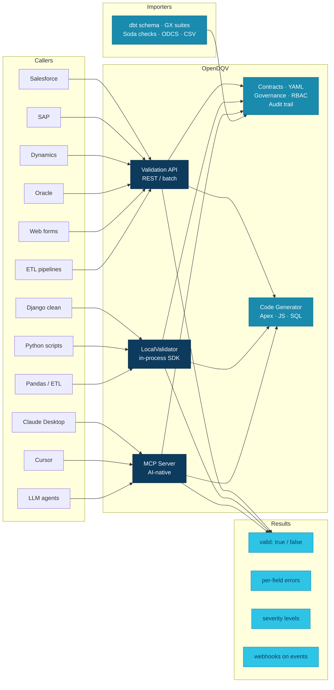

<p align="center">
  
</p>

[](https://github.com/OpenDQV/OpenDQV/actions/workflows/ci.yml)
[](https://github.com/OpenDQV/OpenDQV/blob/main/LICENSE)
[](https://pypi.org/project/opendqv/)
[](https://pypi.org/project/opendqv/)
[](https://github.com/orgs/OpenDQV/packages/container/package/opendqv%2Fopendqv)
[](#)
[](https://securityscorecards.dev/#/projects/github.com/OpenDQV/OpenDQV)
[](https://codecov.io/gh/OpenDQV/OpenDQV)
[](https://github.com/astral-sh/ruff)
[](https://www.bestpractices.dev/projects/12229)

| [Quickstart](docs/quickstart.md) | [Rules](docs/rules/) | [Contracts](docs/compliance-contracts.md) | [API](docs/index.md) | [Security](SECURITY.md) | [FAQ](docs/faq.md) |
|---|---|---|---|---|---|

> **"Trust is easier to build than to repair."**
> That is why OpenDQV exists. A `422` at the point of write is cheaper than a data incident three weeks later.

> **Alpha (v1.x).** Under active development. Pin to a specific version — the v1.x API may have breaking changes between minor versions. See [API Stability](#api-stability) for commitments.

**OpenDQV is a write-time data validation service.** Source systems call it before writing data. Bad records return a `422` with per-field errors. Good records pass through. No payload is stored.




A `422` at the point of write closes the feedback loop — producers see failures immediately and fix them at source. Rejection rates drop over time because the tool changes the incentive, not just the outcome.

For post-landing monitoring use [Great Expectations](https://greatexpectations.io), [Soda](https://www.soda.io), or [dbt tests](https://docs.getdbt.com/docs/build/tests) — they're complementary, not competing. OpenDQV owns layer one (write-time enforcement); those tools own layer three (post-ingestion observability).

---

## Install

| I have... | Command |
|-----------|---------|
| Python 3.11+ | `git clone https://github.com/OpenDQV/OpenDQV.git && cd OpenDQV && bash install.sh` |
| Docker | `git clone https://github.com/OpenDQV/OpenDQV.git && cd OpenDQV && cp .env.example .env && docker compose up -d` |
| Just the SDK/CLI | `pip install opendqv` |
| None of the above | [Beginner setup guide →](docs/beginner-quickstart.md) |

`install.sh` creates a virtual environment, installs dependencies, and launches the onboarding wizard. Docker pulls `ghcr.io/opendqv/opendqv:latest` — no build step required.

> ⚠️ `AUTH_MODE=open` (the default) has **no authentication**. Set `AUTH_MODE=token` and a strong `SECRET_KEY` in `.env` before any non-local deployment. See [SECURITY.md](SECURITY.md).

---

## Your First Validation

**1. Write a contract** — drop a YAML file in `contracts/`:

```yaml
contract:
  name: order
  version: "1.0"
  owner: "Data Governance"
  status: active
  rules:
    - name: valid_email
      type: regex
      field: email
      pattern: "^[^@\\s]+@[^@\\s]+\\.[^@\\s]+$"
      severity: error
      error_message: "Invalid email format"
    - name: amount_positive
      type: min
      field: amount
      min: 0.01
      severity: error
      error_message: "Order amount must be positive"
    - name: status_valid
      type: allowed_values
      field: status
      allowed_values: [pending, confirmed, shipped, cancelled]
      severity: error
      error_message: "Invalid order status"
```

**2. Reload contracts:**

```bash
curl -X POST http://localhost:8000/api/v1/contracts/reload
```

**3. Send a bad record — OpenDQV rejects it:**

```bash
curl -s -X POST http://localhost:8000/api/v1/validate \
  -H "Content-Type: application/json" \
  -d '{"contract": "order", "record": {"email": "not-an-email", "amount": -5, "status": "unknown"}}'
```

```json
{
  "valid": false,
  "errors": [
    {"field": "email",  "rule": "valid_email",    "message": "Invalid email format",        "severity": "error"},
    {"field": "amount", "rule": "amount_positive", "message": "Order amount must be positive", "severity": "error"},
    {"field": "status", "rule": "status_valid",    "message": "Invalid order status",        "severity": "error"}
  ],
  "contract": "order",
  "version": "1.0"
}
```

**4. Fix the record — it passes:**

```bash
curl -s -X POST http://localhost:8000/api/v1/validate \
  -H "Content-Type: application/json" \
  -d '{"contract": "order", "record": {"email": "alice@example.com", "amount": 49.99, "status": "pending"}}'
```

```json
{"valid": true, "errors": [], "warnings": [], "contract": "order", "version": "1.0"}
```

The `customer` contract ships pre-seeded if you want to skip step 1. The [quickstart guide](docs/quickstart.md) walks through authoring, lifecycle, and batch validation.

---

## Rules

| Type | What it checks |
|------|----------------|
| `not_empty` | Field is present and non-empty |
| `regex` | Field matches (or does not match) a pattern. Built-ins: `builtin:email`, `builtin:uuid`, `builtin:ipv4`, `builtin:url` |
| `min` / `max` / `range` | Numeric bounds |
| `min_length` / `max_length` | String length |
| `date_format` | Parseable date/datetime. Falls back through common formats if no explicit format is set |
| `allowed_values` | Value must be in a fixed list |
| `lookup` | Value must appear in a local file or HTTP endpoint (with TTL cache) |
| `compare` | Cross-field: `field` op `compare_to` — supports `gt`, `lt`, `gte`, `lte`, `eq`, `neq`, and `today`/`now` sentinels |
| `required_if` / `forbidden_if` | Conditional: required or forbidden when another field equals a value |
| `checksum` | Check-digit integrity: IBAN, GTIN/GS1, NHS, ISIN, LEI, VIN, CPF, ISRC |
| `unique` | No duplicates within a batch (batch mode only) |
| `cross_field_range` | Value must be between two other fields in the same record |
| `field_sum` | Sum of named fields must equal a target (within optional tolerance) |
| `geospatial_bounds` | Lat/lon pair within a bounding box |
| `date_diff` | Difference between two date fields within a range |
| `age_match` | Declared age consistent with date-of-birth field |

Rules have `severity: error` (blocks the record) or `severity: warning` (flags but allows).
Any rule can include a `condition` block to apply it only when another field equals a given value.

Full reference: [docs/rules/](docs/rules/)

---

## How it compares

A mature data governance programme operates across three layers, each with a distinct job:

| Layer | Purpose | Tools |
|---|---|---|
| **1. Write-time enforcement** | Prevent bad data from entering any system | **OpenDQV** |
| **2. Catalog / governance / stewardship** | Ownership, glossary, lineage, policy, stewardship workflows | Alation, Atlan, Collibra, Purview, DataHub, Marmot |
| **3. Pipeline testing / observability** | Detect drift, freshness issues, residual quality after ingestion | Great Expectations, Soda Core, dbt tests, Monte Carlo |

OpenDQV Core owns layer one. Your catalog handles layer two, your pipeline tools handle layer three.

| | Great Expectations / Soda / dbt | OpenDQV |
|---|---|---|
| **When** | After data lands (in warehouse/lake) | Before data is written (at the door) |
| **Where** | Data pipelines, batch jobs | Source system integration points |
| **Model** | Scan data at rest | Validate data in flight |
| **Latency** | Minutes to hours (batch) | Milliseconds (API call) |
| **Who calls it** | Data engineers | Application developers, CRM admins |

**They're complementary.** Use Great Expectations to monitor your warehouse. Use OpenDQV to stop bad data from getting there in the first place.

---

## Contracts

44 production-ready contracts ship in `contracts/` covering GDPR, HIPAA, SOX, MiFID II,
UK Building Safety Act, Martyn's Law, Natasha's Law, Ofcom Online Safety Act, EU DORA,
and 20+ other regulatory frameworks across UK, EU, and US.

See [docs/compliance-contracts.md](docs/compliance-contracts.md) for the full list with
regulatory context, or browse [contracts/](contracts/) directly.
17 minimal starter templates are in [examples/starter_contracts/](examples/starter_contracts/).

---

## Performance

EC2 c6i.large, 2 workers, 12-rule contract, mixed 50/50 workload:
**~482 req/s, p99 ~182 ms.** Sizing rule: `WEB_CONCURRENCY = number of vCPUs`.

See [docs/benchmark_throughput.md](docs/benchmark_throughput.md) for full platform comparison,
methodology, and monthly volume extrapolation.

---

## Documentation

| | |
|---|---|
| [Quickstart](docs/quickstart.md) | Build your first contract in 15 minutes |
| [Rules Reference](docs/rules/) | All rule types with parameters and examples |
| [Compliance Contracts](docs/compliance-contracts.md) | 44 contracts with regulatory context |
| [API Reference](docs/index.md) | REST endpoints, SDK, GraphQL, webhooks |
| [Security](SECURITY.md) | Deployment checklist, threat model, RBAC |
| [Production Deployment](docs/production_deployment.md) | Token auth, TLS, Docker Compose, hardening |
| [Integrations](docs/index.md) | Salesforce, Kafka, Snowflake, dbt, Databricks, MCP, and more |
| [All docs →](docs/) | 76 documentation files |

---

## API Stability

OpenDQV is in Alpha. The following stability commitments apply to the v1.x series:

- **REST API endpoints** — paths, request bodies, and response shapes may change between minor versions (`1.x`). Patch versions (`1.x.y`) will not change existing endpoint behaviour.
- **YAML contract format** — the contract schema (rules, fields, types) is stable within a minor version. New rule types may be added without notice; existing rules will not change semantics within a minor version.
- **Python SDK** — `OpenDQVClient`, `AsyncOpenDQVClient`, and `LocalValidator` public method signatures are stable within a minor version. Internal helpers (prefixed `_`) are not covered.
- **MCP tools** — tool names and parameters are stable within a minor version.

When OpenDQV moves to Beta, the REST API will be considered stable within major versions (`v2.x`) and backwards-incompatible changes will require a major version bump.

---

## Contributing

See [CONTRIBUTING.md](CONTRIBUTING.md) for setup instructions, coding guidelines, and how to submit changes.

## License

MIT — see [LICENSE](LICENSE).

## Acknowledgements

**Led by [Sunny Sharma](https://uk.linkedin.com/in/sunny-sharma-3927632), [BGMS Consultants Ltd](https://www.bgmsconsultants.com).** The vision, the architecture, every contract, and every design decision in this repository are directed by a human who believes data quality is a write-time responsibility.

OpenDQV is built with a hybrid team. Sunny leads — carbon and silicon. Three AI collaborators execute: Claude Sonnet 4.6 (primary developer), Claude Opus 4.6 (strategic auditor), and Grok (market intelligence). All answer to the same ethos: *trust is easier to build than to repair.*

