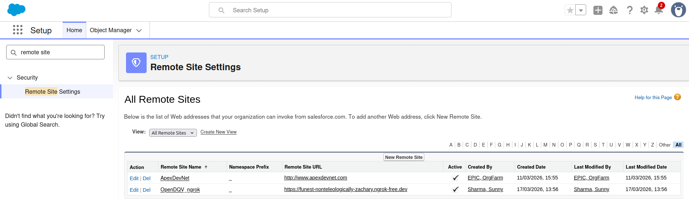
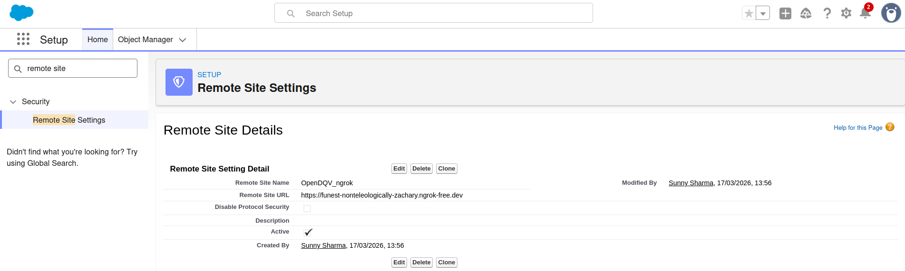

# Salesforce Integration

OpenDQV integrates with Salesforce across a spectrum — from zero infrastructure to fully governed enterprise validation. Start with Approach 1 and upgrade when you need it.

---

## Quick start — validate a Contact in 5 minutes

### 1. Use the built-in salesforce_contact contract

OpenDQV ships `contracts/salesforce_contact.yaml` with 18 production-grade validation rules out of the box — no setup required. To write your own:

```yaml
contract:
  name: salesforce_contact
  version: "1.0"
  description: "Salesforce Contact quality validation"
  owner: "Data Governance Team"
  status: active

  rules:
    - name: first_name_required
      field: FirstName
      type: not_empty
      severity: error
      error_message: "FirstName is required."

    - name: email_format
      field: Email
      type: regex
      pattern: "^[\\w\\.\\+\\-]+@[\\w\\.-]+\\.[a-zA-Z]{2,}$"
      severity: error
      error_message: "Email must be a valid format."

    - name: birthdate_format
      field: Birthdate
      type: date_format
      severity: error
      error_message: "Birthdate must be YYYY-MM-DD."

  contexts:
    salesforce_prod:
      Birthdate:
        min_age: 18
        max_age: 150
        error_message: "Contact must be 18+ in production."

    salesforce_sandbox:
      Email:
        type: regex
        pattern: "^.*@(example\\.com|test\\.com)$"
        error_message: "Sandbox contacts must use test email domains."
```

### 2. Reload contracts

```bash
curl -X POST http://localhost:8000/api/v1/contracts/reload
```

### 3. Validate a record

```bash
# Production context — enforces 18+ age
curl -X POST http://localhost:8000/api/v1/validate \
  -H "Content-Type: application/json" \
  -d '{
    "record": {"FirstName": "Sarah", "Email": "sarah@acme.com", "Birthdate": "2015-03-15"},
    "contract": "salesforce_contact",
    "context": "salesforce_prod"
  }'
```

Response (blocked — contact is under 18):
```json
{
  "valid": false,
  "errors": [{"field": "Birthdate", "rule": "birthdate_format", "message": "Contact must be 18+ in production.", "severity": "error"}],
  "warnings": []
}
```

### 4. Wire into a trigger

```apex
// Phase 1 — push-down (no callout required):
Map<String, Object> data = new Map<String, Object>{
    'FirstName' => contact.FirstName,
    'Email'     => contact.Email,
    'Birthdate' => String.valueOf(contact.Birthdate)
};
if (!OpenDQVValidator.validateRecord(data, 'salesforce_contact')) {
    contact.addError('Record failed data quality validation');
}
```

Use the **Integration Guide** tab in the Streamlit UI to generate ready-to-paste Apex, JavaScript, Python, cURL, Power Automate, and GraphQL snippets.

For the full Approach 1 (push-down) and Approach 2 (live callout) patterns, read on.

---

## The spectrum

```
Approach 1: Push-down Apex              Approach 2: HTTP callout
─────────────────────────────────────────────────────────────
Zero infrastructure                  Live governance
No API calls at runtime              Always in sync with contract
Fast (runs in trigger context)       Single source of truth
Snapshot — can drift                 Never drifts
```

Both approaches tested end-to-end against a Salesforce dev org (2026-03-17):
- **Approach 1 ✅** — Apex class deployed, FAIL and PASS cases confirmed in Before Insert trigger
- **Approach 2 ✅** — HTTP callout to live OpenDQV API, FAIL and PASS cases confirmed in Before Insert trigger via ngrok

Most teams start with Approach 1 and graduate to Approach 2 when the contract update cadence makes drift a real operational risk.

---

## Approach 1: Push-down Apex

### How it works

OpenDQV generates an Apex class (`OpenDQVValidator`) that encodes your contract rules as native Salesforce logic. You deploy it once and wire it into a trigger. No callout, no API key, no latency overhead.

The trade-off: it's a **snapshot**. If the contract changes, the deployed class doesn't update automatically — you have to re-generate and re-deploy.

### Generate the Apex class

```bash
# From CLI
opendqv generate <contract-name> salesforce

# With context filter (e.g. only salesforce-tagged rules)
opendqv generate <contract-name> salesforce --context salesforce

# Via API
GET /contracts/<contract-name>/generate?target=salesforce
```

The generated class includes a header that tells you exactly which contract version and timestamp it was built from:

```apex
// Generated by OpenDQV — push-down validation snapshot
// Contract: customer v1.2 | Generated: 2026-03-16T10:00:00Z
// SYNC REMINDER: This class is a snapshot of the contract rules at generation
// time. Re-run if the contract has been updated:
//   opendqv generate customer salesforce
// For live governance (always in sync), see the HTTP callout integration.
```

### Deploy steps

1. Copy the generated Apex into a new file: `force-app/main/default/classes/OpenDQVValidator.cls`
2. Deploy to your org:
   ```bash
   sf project deploy start --source-dir force-app/main/default/classes/OpenDQVValidator.cls
   ```
3. Wire it into a trigger (see below).

### Trigger wiring example

```apex
trigger AccountDQVTrigger on Account (before insert, before update) {
    List<Map<String, Object>> records = new List<Map<String, Object>>();
    for (Account a : Trigger.new) {
        records.add(new Map<String, Object>{
            'name'  => a.Name,
            'email' => a.Email__c,
            'age'   => a.Age__c
        });
    }

    List<Map<String, Object>> results = OpenDQVValidator.validate(records);
    for (Integer i = 0; i < Trigger.new.size(); i++) {
        Map<String, Object> result = results[i];
        List<Object> errors = (List<Object>) result.get('errors');
        List<Object> warnings = (List<Object>) result.get('warnings');
        if (!errors.isEmpty()) {
            Trigger.new[i].addError('OpenDQV validation failed: ' + errors);
        }
        if (!warnings.isEmpty()) {
            System.debug('OpenDQV warnings for ' + Trigger.new[i].LastName + ': ' + warnings);
        }
    }
}
```

> **Sync reminder:** The deployed `OpenDQVValidator` class is a snapshot. If your contract rules change, re-run `opendqv generate <contract-name> salesforce` and redeploy. The generation header shows the timestamp — use it to audit whether the deployed class is current.

### Governor limits note

Regex rules consume CPU time in the Apex execution context. For contracts with many complex regex patterns, profile against Salesforce governor limits in a sandbox before deploying to production. For high-cardinality regex-heavy contracts, Approach 2 (HTTP callout) offloads the compute to OpenDQV's API.

---

## When to upgrade to Approach 2

Use this decision matrix to assess whether push-down Apex is still the right fit:

| Question | Stay on Approach 1 | Consider Approach 2 |
|----------|----------------|-----------------|
| How often does the contract change? | Rarely (monthly or less) | Frequently (weekly or more) |
| Who owns the Salesforce deployment process? | You / your team | Separate release team with long cycles |
| Can you tolerate a sync window between contract update and Salesforce enforcement? | Yes, a day or two is fine | No — must be instant |
| Are your contracts simple (not regex-heavy)? | Yes | No — regex-heavy, governor limits are a concern |
| Do you validate across multiple Salesforce orgs? | No | Yes |
| Is audit traceability to the live contract version required? | Nice to have | Hard requirement |
| Do you have a network path from Salesforce to OpenDQV? | Not yet | Yes (or willing to set it up) |
| Are you already running OpenDQV in production with uptime SLAs? | No | Yes |

If you answered "Consider Approach 2" to three or more of these, read on.

---

## Approach 2: HTTP callout

### How it works

Instead of deploying a generated class, the Salesforce trigger makes a real-time HTTP callout to the OpenDQV `/validate` endpoint. The contract lives in OpenDQV — Salesforce is always in sync.

### Prerequisites

- OpenDQV running locally on port 8000 (or deployed at a reachable URL)
- Salesforce Developer Edition org or sandbox
- Salesforce CLI (`sf`) installed
- [ngrok](https://ngrok.com/download) installed (free tier is sufficient for local testing)

### Step 1: Expose your local API via ngrok

[ngrok](https://ngrok.com) creates a temporary public HTTPS tunnel to your local machine, letting Salesforce's cloud infrastructure reach an API running on your laptop. Without it, Salesforce cannot make callouts to `localhost`.

```bash
ngrok http 8000
```

The terminal will show a forwarding URL:

```
Forwarding  https://abc123.ngrok-free.dev -> http://localhost:8000
```

Copy the `https://...ngrok-free.dev` URL — you'll need it in the next step.

> The free ngrok tier generates a new random URL each session. If you stop and restart ngrok, update the Remote Site entry (step 2) with the new URL.

### Step 2: Register the tunnel in Salesforce Remote Site Settings

Salesforce blocks all outbound HTTP callouts by default. You must explicitly allowlist the destination URL before any Apex callout will succeed.

1. In Salesforce Setup, search for **Remote Site Settings** in the left sidebar (or navigate to **Security → Remote Site Settings**)
2. Click **New Remote Site**
3. Fill in the form:
   - **Remote Site Name:** `OpenDQV_ngrok`
   - **Remote Site URL:** paste your ngrok HTTPS URL (e.g. `https://abc123.ngrok-free.dev`)
   - **Disable Protocol Security:** leave unchecked
   - **Active:** check this box
4. Click **Save**

The new entry will appear in the Remote Sites list with a checkmark in the Active column. Salesforce can now make outbound callouts to your ngrok tunnel.

Here's what the Remote Site Settings list looks like with the OpenDQV ngrok entry registered and active:



And the detail view showing exactly how the entry is configured — note `Disable Protocol Security` is left unchecked, and `Active` is ticked:



> The ngrok URL shown here (`https://funest-nonteleologically-zachary.ngrok-free.dev`) was a live tunnel used to test and write this guide — it has since been torn down. Your URL will be different each session.

### Callout context — Before vs After triggers

**Before Insert/Update triggers** (write-time blocking — the recommended pattern):

No DML has committed yet. A synchronous HTTP callout is permitted. If validation fails, call `record.addError()` to block the save entirely — the record never reaches the database. This is the correct pattern for OpenDQV's write-time blocking use case.

**After Insert/Update triggers** (post-save async validation — different use case):

DML has already committed. Synchronous callouts are not permitted in the same transaction. Use `@future(callout=true)` for asynchronous post-save validation. The record is already in the database — you can flag it but cannot prevent the write. This is a monitoring pattern, not a blocking pattern.

> For write-time blocking — the OpenDQV use case — always use a **Before trigger** with a synchronous callout.

### Step 3: Deploy the callout class and trigger

Copy the `OpenDQVCallout` class and trigger below into your Salesforce project, then deploy:

```bash
sf project deploy start --source-dir force-app --target-org mydevorg
```

### Apex callout class

```apex
public class OpenDQVCallout {
    /**
     * Validate a batch of records against an OpenDQV contract.
     * Call from a Before Insert/Update trigger — synchronous callout is permitted
     * before DML commits.
     *
     * Pass an optional context (e.g. 'salesforce_prod', 'salesforce_sandbox') to
     * apply context-specific validation rules from the contract.
     *
     * Returns the 'results' array from the OpenDQV batch response, or null on failure.
     * Caller must check each result's 'valid' field and call record.addError() as needed.
     */
    public static List<Object> validate(
        String contractName,
        List<Map<String, Object>> records,
        String context
    ) {
        HttpRequest req = new HttpRequest();
        req.setEndpoint('callout:OpenDQV/api/v1/validate/batch');
        req.setMethod('POST');
        req.setHeader('Content-Type', 'application/json');

        Map<String, Object> payload = new Map<String, Object>{
            'contract' => contractName,
            'records'  => records
        };
        if (String.isNotBlank(context)) {
            payload.put('context', context);
        }
        req.setBody(JSON.serialize(payload));
        req.setTimeout(10000);  // 10s — well within governor limit for ~4ms p50 responses

        try {
            HttpResponse res = new Http().send(req);

            if (res.getStatusCode() == 200) {
                Map<String, Object> body =
                    (Map<String, Object>) JSON.deserializeUntyped(res.getBody());
                return (List<Object>) body.get('results');
            }

            // Non-200 from OpenDQV (e.g. 422 malformed request, 404 unknown contract)
            System.debug('OpenDQV: unexpected status ' + res.getStatusCode()
                         + ' — ' + res.getBody());

            // POLICY CHOICE — non-200 response:
            // Fail-open (default): record saves when OpenDQV returns an error.
            return null;
            // Fail-closed (uncomment): record blocked on any OpenDQV error.
            // throw new CalloutException('OpenDQV error ' + res.getStatusCode());

        } catch (System.CalloutException e) {
            // OpenDQV unreachable (timeout, DNS failure, ngrok tunnel down, etc.)
            System.debug('OpenDQV: service unreachable — ' + e.getMessage());

            // POLICY CHOICE — service unreachable:
            // Fail-open (default): record saves if OpenDQV cannot be reached.
            // Use for: non-critical data, development environments.
            return null;
            // Fail-closed (uncomment): record blocked if OpenDQV cannot be reached.
            // Use for: regulated data where a bad record is worse than a failed save.
            // throw new CalloutException(
            //     'OpenDQV: validation service unreachable. Record blocked for safety.');
        }
    }
}
```

### Before trigger wiring

```apex
trigger OpenDQVContactTrigger on Contact (before insert, before update) {
    List<Map<String, Object>> records = new List<Map<String, Object>>();
    for (Contact c : Trigger.new) {
        records.add(new Map<String, Object>{
            'FirstName' => c.FirstName,
            'LastName'  => c.LastName,
            'Email'     => c.Email,
            'Birthdate' => c.Birthdate != null ? String.valueOf(c.Birthdate) : null
        });
    }

    // Pass a context to apply environment-specific rules (e.g. 18+ age in prod).
    // Use 'salesforce_sandbox' for test orgs, 'salesforce_prod' for production.
    List<Object> results = OpenDQVCallout.validate('salesforce_contact', records, 'salesforce_prod');

    if (results == null) {
        // Fail-open: OpenDQV unreachable or returned an error — records pass through.
        // Switch to fail-closed in OpenDQVCallout if you need hard blocking.
        return;
    }

    for (Integer i = 0; i < results.size(); i++) {
        Map<String, Object> result = (Map<String, Object>) results.get(i);
        if (result.get('valid') == false) {
            List<Object> errors = (List<Object>) result.get('errors');
            String msg = 'OpenDQV validation failed:';
            for (Object err : errors) {
                Map<String, Object> e = (Map<String, Object>) err;
                msg += ' [' + e.get('field') + '] ' + e.get('message') + ';';
            }
            Trigger.new[i].addError(msg);
        }
    }
}
```

> **Governor limit note:** A Before trigger with a single batch callout to `/api/v1/validate/batch` uses **one** of the 100 allowed callouts per transaction, regardless of how many records are in the trigger batch (up to 200). The total callout time at OpenDQV's ~4ms p50 is well within the 120-second transaction limit.

### Step 4: Test the connection

With ngrok running, the Remote Site registered, and the trigger deployed, test using the Salesforce CLI:

```bash
# FAIL — invalid email format
sf data create record \
    --sobject Contact \
    --values "FirstName='Test' LastName='Phase2Fail' Email='not-an-email'" \
    --target-org mydevorg
# Error (1): Email: invalid email address: not-an-email

# FAIL — missing required field (OpenDQV blocks the write)
sf data create record \
    --sobject Contact \
    --values "LastName='Phase2Fail' Email='test@example.com'" \
    --target-org mydevorg
# Error (1): OpenDQV validation failed: (FirstName is required.)

# PASS — valid Contact
sf data create record \
    --sobject Contact \
    --values "FirstName='Test' LastName='Phase2Pass' Email='test.phase2@example.com'" \
    --target-org mydevorg
# Successfully created record: 003dL00001TbdobQAA.
```

Both FAIL cases confirm validation is running before the record reaches the database. The PASS case confirms the tunnel, Remote Site, and trigger are all wired correctly.

### Step 5: Clean up after testing

Once you're done, remove the temporary ngrok wiring so Salesforce isn't left pointing at a dead tunnel:

1. **Stop ngrok** — `Ctrl+C` in the ngrok terminal, or `pkill ngrok`
2. **Remove the Remote Site entry** — Setup → Security → Remote Site Settings → find the `OpenDQV_ngrok` row → Edit → uncheck *Active* (or Delete)
3. **Optionally deactivate the trigger** — Setup → Custom Code → Apex Triggers → `ContactOpenDQVCalloutTrigger` → Edit → uncheck *Active*
   - Keeps the code in place for later; stops callouts while no OpenDQV instance is reachable
4. **For a full teardown** — delete `OpenDQVCallout` and `ContactOpenDQVCalloutTrigger` from your org, or run `sf project deploy start --source-dir force-app --target-org mydevorg --purge-on-delete`

> **If you skip step 2 and the ngrok URL expires**, Salesforce will throw `System.CalloutException: Web service callout failed` on every Contact insert. The trigger fails open (record still saves) but the error appears in Apex debug logs.

### Named Credential setup (production)

For production, replace the Remote Site entry with a Named Credential — it stores both the base URL and auth token securely inside Salesforce:

1. Setup → Security → Named Credentials → New Legacy Named Credential
2. **Label:** `OpenDQV`
3. **URL:** `https://your-opendqv-host` (base URL only — the Apex code appends `/api/v1/validate/batch`)
4. **Authentication Protocol:** Custom Headers
5. Add header: `Authorization: Bearer <your-token>`

No Apex code changes are needed — `req.setEndpoint('callout:OpenDQV/api/v1/validate/batch')` resolves the Named Credential label automatically.

---

## Hybrid approach

During migration from Approach 1 to Approach 2, you can run both in parallel:

1. Keep the deployed `OpenDQVValidator` class as the primary synchronous check (before insert/update). Records are validated against the snapshot — fast, no network.
2. Add a **second** Before trigger (lower order) that calls `OpenDQVCallout.validate()` in fail-open mode and logs any discrepancy between the snapshot result and the live contract result via `System.debug`.
3. Once the live callout path is stable and the team trusts the latency budget, remove the snapshot class and switch `OpenDQVCallout` to fail-closed.

This gives you a zero-downtime upgrade path with a built-in canary period.

---

## The one-liner

> **Approach 1** is the fastest path to Salesforce-native DQ enforcement — zero infrastructure, deploys in minutes.
> **Approach 2** is the right answer when your contracts evolve faster than your Salesforce release cycle.

Both use the same contracts. The difference is where validation logic lives.
